# Spotify Genre Sorter - Backlog

> **v2.0 Release Scope** - Major feature expansion

---

## Effort Legend
- **XS** = Trivial (< few lines)
- **S** = Small (single file, straightforward)
- **M** = Medium (multiple files, some complexity)
- **L** = Large (significant feature, testing needed)
- **XL** = Extra Large (architectural change, multiple systems)

## Priority Legend
- **P0** = Critical (blocking/broken)
- **P1** = High (core functionality)
- **P2** = Medium (important enhancement)
- **P3** = Low (nice to have)
- **P4** = Backlog (future consideration)

---


## v3.x Completed Tasks ✅

<details open>
<summary>Click to see completed tasks from v3.0-v3.3</summary>

### v3.3.0
- ✅ UI redesign with glassmorphism effects
- ✅ Playlist scanning - browse and analyse any playlist
- ✅ User preferences - cloud-synced settings
- ✅ Tutorial system for new users
- ✅ Rate limit warning banner
- ✅ Invite request system for Spotify whitelist
- ✅ Status page link in footer

### v3.2.0
- ✅ Special user tags in leaderboard (Creator, Queen)
- ✅ Genre merging - combine multiple genres into one playlist

### v3.1.0
- ✅ Admin panel UI in frontend
- ✅ Genie click animation with speech bubbles
- ✅ "Normal mode huh?" jokes when leaving Swedish mode

### v3.0.0
- ✅ Progressive scanning for 2000+ track libraries
- ✅ Admin debug panel (/api/admin)
- ✅ Confetti celebration on playlist creation

</details>

---

## v1.x Completed Tasks ✅

<details>
<summary>Click to expand completed tasks from v1.0-v1.4</summary>

- ✅ Genre caching in KV (v1.2.0)
- ✅ Playlist naming customisation (v1.2.0)
- ✅ Genre filtering/exclusion (v1.2.0)
- ✅ Dark/light theme toggle (v1.2.0)
- ✅ Mobile responsive improvements (v1.2.0)
- ✅ Export/import genre data (v1.2.0)
- ✅ Genre statistics dashboard (v1.2.0)
- ✅ Progressive loading for large libraries (v1.2.1)
- ✅ Real-time deployment monitor (v1.3.0)
- ✅ Duplicate playlist detection (v1.3.0)
- ✅ Swedish Easter eggs (v1.0.0)
- ✅ Hall of Fame (first 10 users) (v1.0.0)
- ✅ Security headers & CSP (v1.1.0)
- ✅ Keyboard shortcuts (v1.4.0)
- ✅ Accessibility improvements (v1.4.0)
- ✅ PDF documentation (v1.3.0)

</details>

---

## v2.0 Key Decisions ✅

| Decision | Choice | Rationale |
|----------|--------|-----------|
| **App Name** | Genre Genie ✨ | Playful, memorable, magic theme |
| **Loading Animation** | Actual album art | Personal touch, uses user's real tracks |
| **Recent Playlists Feed** | Public | Anyone can see, encourages discovery |
| **Implementation** | Full v2.0 | All 25 tasks in sprint order |

---

## v2.0 Backlog

### 🔧 Bug Fixes & Polish

#### 28. Light Mode Accessibility Fix
**Priority:** P0 | **Effort:** S | **Status:** ✅ DONE (v3.0.0)

```
PROBLEM:
Light mode has poor text contrast - users report they "can't read anything".
Multiple elements invisible or hard to see.

ROOT CAUSE:
- --text-muted too light (#6c757d)
- --surface-2 and --bg too similar
- Missing borders on cards/buttons
- Some elements don't adapt to light mode

FILES TO MODIFY:
- src/frontend/styles.css (light mode CSS variables + specific overrides)

REQUIREMENTS:
1. Increase contrast for --text-muted (use #495057 or darker)
2. Add visible borders to cards, buttons, inputs in light mode
3. Ensure all interactive elements have visible focus states
4. Test WCAG AA compliance (4.5:1 contrast ratio)
5. Verify all components render correctly:
   - Genre cards
   - Stats boxes
   - Buttons (primary, secondary, ghost)
   - Search input
   - Progress bars
   - Modals

VALIDATION:
- [ ] npm run build succeeds
- [ ] All text readable at 4.5:1 contrast
- [ ] No invisible elements
- [ ] Feature parity with dark mode
```

---

#### 29. Theme Toggle Position Consistency
**Priority:** P1 | **Effort:** XS | **Status:** ⏳ PENDING

```
PROBLEM:
Sun/moon theme toggle moves from top header (pre-login) to middle
cache-status area (post-login). Inconsistent UX.

CURRENT BEHAVIOUR:
- Pre-login: Theme toggle in #header-actions (top right)
- Post-login: Theme toggle moves to .cache-status (middle)

DESIRED:
- Theme toggle ALWAYS in header, same position
- User info appears next to it after login

FILES TO MODIFY:
- src/frontend/app.js (renderHeaderUser function, ~line 571)

REQUIREMENTS:
1. Keep theme toggle in #header-actions always
2. Modify renderHeaderUser to ADD user info, not replace
3. Layout: [Theme Toggle] [Avatar] [Username] [Logout]

VALIDATION:
- [ ] Toggle stays in same position before/after login
- [ ] User info displays correctly after login
- [ ] Mobile responsive layout works
```

---

#### 30. Swedish Mode State Management Fix
**Priority:** P2 | **Effort:** M | **Status:** ⏳ PENDING

```
PROBLEM:
Toggling Swedish mode causes GUI/buttons/loading to enter "weird states".
Some elements don't update correctly, state inconsistencies.

SYMPTOMS:
- Donation button text may not update
- Loading messages may not change
- Stats labels may be wrong language
- Button states may be incorrect

ROOT CAUSE:
- State changes scattered across multiple functions
- No centralised mode switching
- Some elements not in the re-render cycle

FILES TO MODIFY:
- src/frontend/app.js (toggleSwedishMode and related functions)

REQUIREMENTS:
1. Create centralised applySwedishMode(enabled) function
2. Move ALL Swedish-specific updates into this function
3. Add state validation after toggle
4. Ensure these components update:
   - Donation button (durry ↔ snus)
   - All [data-i18n] elements
   - Loading messages
   - Stats labels
   - Button labels
   - Hall of Fame title
   - Placeholder text
5. Test toggle in all app states:
   - Welcome screen
   - Loading screen
   - Genre list screen
   - Results screen

VALIDATION:
- [ ] No visual glitches on toggle
- [ ] All text updates correctly
- [ ] State persists on reload
- [ ] Works in combination with light/dark mode
```

---

#### 31. Version Widget Reliability
**Priority:** P2 | **Effort:** S | **Status:** ⏳ PENDING

```
PROBLEM:
GitHub version widget "randomly disappears" and doesn't show release name.
Users want it always visible and drill-downable.

ISSUES:
1. Widget hidden when GitHub API fails/slow
2. No release name shown (just version number)
3. Not clear it's clickable

FILES TO MODIFY:
- src/frontend/app.js (updateDeployWidget, ~line 145)
- src/frontend/styles.css (widget styling)

REQUIREMENTS:
1. ALWAYS show widget (even if API fails)
2. Cache last known status in localStorage
3. Show release name from /api/changelog
4. Format: "v1.4.0 • Keyboard Shortcuts • 2h ago"
5. Add visual indicator that it's clickable (hover effect)
6. Fallback when offline: show cached version

VALIDATION:
- [ ] Widget visible on every page load
- [ ] Shows release name
- [ ] Clickable indication obvious
- [ ] Works offline (cached)
```

---

### 🏆 Leaderboard & Scoreboard System

#### 32. Expanded User Statistics Schema
**Priority:** P1 | **Effort:** M | **Status:** ⏳ PENDING

```
PROBLEM:
Current user tracking only stores basic info. Need to track:
- Genres discovered per user
- Artists analysed
- Tracks scanned
- Playlists created

NEW KV SCHEMA:
user_stats:{spotifyId} -> {
  spotifyId: string,
  spotifyName: string,
  spotifyAvatar: string,
  totalGenresDiscovered: number,
  totalArtistsDiscovered: number,
  totalTracksAnalysed: number,
  playlistsCreated: number,
  firstSeen: ISO string,
  lastActive: ISO string,
  createdPlaylistIds: string[]  // For future features
}

FILES TO MODIFY:
- src/routes/auth.ts (initialise stats on new user)
- src/routes/api.ts (update stats on genre fetch & playlist create)
- src/lib/session.ts (add helper functions)

REQUIREMENTS:
1. Update registerUser() to create initial stats
2. Update /api/genres to increment stats after analysis
3. Update /api/playlist to increment playlistsCreated
4. Add getUserStats(spotifyId) helper
5. Add updateUserStats(spotifyId, updates) helper

VALIDATION:
- [ ] New users get stats record
- [ ] Stats update on genre fetch
- [ ] Stats update on playlist creation
- [ ] Stats persist across sessions
```

---

#### 33. Scoreboard API Endpoint
**Priority:** P1 | **Effort:** M | **Status:** ⏳ PENDING

```
IMPLEMENTATION:
Create /api/scoreboard endpoint returning top users by category.

ENDPOINT: GET /api/scoreboard

RESPONSE:
{
  byGenres: [{ rank, spotifyId, spotifyName, spotifyAvatar, count }],
  byArtists: [...],
  byTracks: [...],
  byPlaylists: [...],
  totalUsers: number,
  updatedAt: ISO string
}

CACHING:
- Cache result in KV: scoreboard_cache
- TTL: 5 minutes
- Invalidate on significant changes

FILES TO CREATE/MODIFY:
- src/routes/api.ts (new endpoint)

REQUIREMENTS:
1. Create /api/scoreboard endpoint
2. Query all user_stats:* keys
3. Sort and rank by each category
4. Return top 20 per category
5. Cache results in KV
6. Add cache headers for browser caching

VALIDATION:
- [ ] Endpoint returns correct rankings
- [ ] Rankings update when stats change
- [ ] Cache works correctly
- [ ] Performance acceptable (<500ms)
```

---

#### 34. Leaderboard API Endpoint
**Priority:** P1 | **Effort:** S | **Status:** ⏳ PENDING

```
IMPLEMENTATION:
Create /api/leaderboard endpoint returning pioneers + new users.

ENDPOINT: GET /api/leaderboard

RESPONSE:
{
  pioneers: [{ position, spotifyId, spotifyName, spotifyAvatar, joinedAt }],
  newUsers: [{ spotifyId, spotifyName, spotifyAvatar, joinedAt }],
  totalUsers: number
}

FILES TO MODIFY:
- src/routes/api.ts (new endpoint, can reuse existing /stats logic)

REQUIREMENTS:
1. Pioneers: First 10 users (from hof:* keys)
2. New Users: Last 10 registered (sorted by joinedAt desc)
3. Include avatar URLs for display

VALIDATION:
- [ ] Returns correct pioneers
- [ ] Returns recent users
- [ ] Avatars load correctly
```

---

#### 35. Left Sidebar UI Component
**Priority:** P1 | **Effort:** L | **Status:** ⏳ PENDING

```
IMPLEMENTATION:
Add left sidebar showing leaderboard, new users, recent playlists.

LAYOUT CHANGE:
+------------------+-------------------------+
|  LEFT SIDEBAR    |     MAIN CONTENT        |
|  (300px fixed)   |     (flex: 1)           |
|                  |                         |
|  🏆 Pioneers     |  [Current Content]      |
|  #1 @user ⭐     |                         |
|  #2 @user        |                         |
|  #3 @user        |                         |
|                  |                         |
|  👋 New Users    |                         |
|  @user - just now|                         |
|                  |                         |
|  🎵 Recent       |                         |
|  indie by @user  |                         |
|                  |                         |
+------------------+-------------------------+

FILES TO MODIFY:
- src/frontend/body.html (layout structure)
- src/frontend/styles.css (sidebar styles)
- src/frontend/app.js (sidebar logic)

REQUIREMENTS:
1. Create sidebar container in HTML
2. Fetch /api/leaderboard on load
3. Display pioneers with gold/silver/bronze styling
4. Display new users with "X ago" timestamps
5. Link to full scoreboard
6. Collapsible on mobile (hamburger or bottom sheet)
7. Smooth animations for updates

VALIDATION:
- [ ] Sidebar displays correctly
- [ ] Pioneers show with regalia
- [ ] New users update in real-time
- [ ] Mobile responsive (collapsible)
- [ ] No layout shift on load
```

---

#### 36. Scoreboard Modal/Page
**Priority:** P2 | **Effort:** M | **Status:** ⏳ PENDING

```
IMPLEMENTATION:
Full scoreboard view with all categories.

UI DESIGN:
+-----------------------------------------------+
|  🏆 Scoreboard                           [X]  |
+-----------------------------------------------+
| [Genres] [Artists] [Tracks] [Playlists]       |
+-----------------------------------------------+
|  #1  👤 @username     1,234 genres            |
|  #2  👤 @username       987 genres            |
|  #3  👤 @username       654 genres            |
|  ...                                          |
|  #15 👤 YOU ⭐          123 genres            |
+-----------------------------------------------+

FILES TO MODIFY:
- src/frontend/app.js (scoreboard modal)
- src/frontend/styles.css (scoreboard styles)

REQUIREMENTS:
1. Tab navigation for categories
2. Top 20 per category
3. Highlight current user's position
4. Profile pics + names
5. Smooth animations
6. Swedish translations

VALIDATION:
- [ ] All categories display
- [ ] Current user highlighted
- [ ] Animations smooth
- [ ] Swedish mode works
```

---

### 🎵 Recent Playlists Feed

#### 37. Recent Playlists KV Storage
**Priority:** P2 | **Effort:** S | **Status:** ⏳ PENDING

```
IMPLEMENTATION:
Store recently created playlists for social feed.

KV SCHEMA:
recent_playlists -> [
  {
    playlistId: string,
    playlistName: string,
    genre: string,
    trackCount: number,
    createdBy: { spotifyId, spotifyName, spotifyAvatar },
    createdAt: ISO string,
    spotifyUrl: string
  }
] (max 20 entries, FIFO)

FILES TO MODIFY:
- src/routes/api.ts (update POST /api/playlist)

REQUIREMENTS:
1. After playlist creation, add to recent_playlists
2. Keep max 20 entries (remove oldest)
3. Include all display data
4. Handle race conditions (use KV atomic operations)

VALIDATION:
- [ ] Playlists added to feed
- [ ] Max 20 entries maintained
- [ ] Data structure correct
```

---

#### 38. Recent Playlists API Endpoint
**Priority:** P2 | **Effort:** XS | **Status:** ⏳ PENDING

```
ENDPOINT: GET /api/recent-playlists

RESPONSE:
{
  playlists: [
    {
      playlistId: "...",
      playlistName: "indie (from Likes)",
      genre: "indie",
      trackCount: 42,
      createdBy: { spotifyId, spotifyName, spotifyAvatar },
      createdAt: "2025-12-02T10:30:00Z",
      spotifyUrl: "https://open.spotify.com/playlist/..."
    }
  ]
}

FILES TO MODIFY:
- src/routes/api.ts

VALIDATION:
- [ ] Returns recent playlists
- [ ] Correct format
- [ ] Auth not required (public feed)
```

---

#### 39. Recent Playlists UI Component
**Priority:** P2 | **Effort:** M | **Status:** ⏳ PENDING

```
IMPLEMENTATION:
Display recent playlists in left sidebar with auto-refresh.

UI:
🎵 Recent Playlists
┌─────────────────────────┐
│ 🎸 indie                │
│ by @username • just now │
│ [Save]                  │
├─────────────────────────┤
│ 🎤 pop                  │
│ by @otheruser • 5m ago  │
│ [Save]                  │
└─────────────────────────┘

FILES TO MODIFY:
- src/frontend/app.js
- src/frontend/styles.css

REQUIREMENTS:
1. Poll /api/recent-playlists every 30 seconds
2. Animate new entries sliding in
3. Show genre emoji + name
4. Show creator avatar + name
5. "Save" button opens Spotify follow URL
6. Smooth scroll for new entries

VALIDATION:
- [ ] Feed updates automatically
- [ ] New entries animate in
- [ ] Save button works
- [ ] No memory leaks from polling
```

---

### 🎬 Loading Experience Overhaul

#### 40. Vinyl/Album Flip Animation
**Priority:** P2 | **Effort:** L | **Status:** ✅ DONE (v3.3.0)

```
PROBLEM:
Current loading UX is functional but not engaging.
User wants vinyl/album art flipping animation.

CONCEPT:
- Album covers flip like a Rolodex
- Genre names cycle below
- Smooth 3D flip effect

IMPLEMENTATION OPTIONS:
A) Use actual album art from track data
   - Pro: Personalised
   - Con: Need to extract during load

B) Generic vinyl/record images
   - Pro: Simpler, consistent
   - Con: Less personal

C) CSS-only abstract animation
   - Pro: Fast, no images needed
   - Con: Less visually interesting

FILES TO MODIFY:
- src/frontend/app.js (renderProgressLoading)
- src/frontend/styles.css (animation keyframes)

REQUIREMENTS:
1. Create flipAnimation component
2. Cycle through genre names during load
3. Smooth 3D CSS transforms
4. Show album art if available
5. Fallback to vinyl graphic

CSS ANIMATION SKETCH:
@keyframes vinylFlip {
  0% { transform: rotateY(0deg); }
  50% { transform: rotateY(90deg); }
  100% { transform: rotateY(0deg); }
}

VALIDATION:
- [ ] Animation smooth (60fps)
- [ ] Genre names cycle
- [ ] Works on mobile
- [ ] Doesn't block loading
```

---

#### 41. Dynamic Completion Messages
**Priority:** P3 | **Effort:** S | **Status:** ✅ DONE (v3.4.0)

```
IMPLEMENTATION:
Generate funny/personalised message based on user's top genres.

MESSAGES BY GENRE:
{
  'rock': "You're a certified rockstar! 🎸",
  'pop': "Pop goes your playlist! 🎤",
  'hip hop': "Straight outta your library! 🎧",
  'electronic': "You've got the beats! 🎹",
  'metal': "Heavy metal thunder! 🤘",
  'indie': "Too cool for mainstream! 🎪",
  'jazz': "Smooth as butter! 🎷",
  'classical': "A person of culture! 🎻",
  'country': "Yeehaw! 🤠",
  'k-pop': "Annyeonghaseyo! 🇰🇷",
  'default': "Your taste is uniquely yours! ✨"
}

FILES TO MODIFY:
- src/frontend/app.js

REQUIREMENTS:
1. Analyse top 3 genres after load complete
2. Select appropriate message
3. Display with celebration animation
4. Add Swedish translations

VALIDATION:
- [ ] Message relevant to top genres
- [ ] Swedish translations work
- [ ] Displays after load complete
```

---

#### 42. Celebration Animation
**Priority:** P3 | **Effort:** M | **Status:** ✅ DONE (v3.0.0 - confetti)

```
IMPLEMENTATION:
Confetti/fireworks animation on load complete.

OPTIONS:
A) CSS-only particles
B) Canvas-based confetti (e.g., canvas-confetti)
C) SVG animation

RECOMMENDED: CSS-only for simplicity

FILES TO MODIFY:
- src/frontend/styles.css
- src/frontend/app.js

REQUIREMENTS:
1. Trigger on 100% load complete
2. ~2 second duration
3. Colours match theme (Spotify green, Swedish blue/yellow)
4. Smooth transition to results view
5. Respects prefers-reduced-motion

VALIDATION:
- [ ] Animation triggers correctly
- [ ] Doesn't block interaction
- [ ] Respects reduced motion preference
- [ ] Theme-appropriate colours
```

---

### 📝 Playlist Creation UX

#### 43. Enhanced Playlist Create Modal
**Priority:** P2 | **Effort:** L | **Status:** ✅ DONE (v3.0.0)

```
CURRENT:
Single "Create" button, no customisation before creation.

DESIRED:
Modal with preview and customisation options.

UI:
+----------------------------------------+
|  Create "emo" Playlist              [X] |
+----------------------------------------+
|  🖤 Title:                              |
|  [Emo (from Likes)           ]          |
|                                         |
|  📝 Description:                        |
|  [Your emo tracks since 2019 from...]   |
|                                         |
|  🖼️ Cover: [Upload] [URL] [Default]     |
|  [Preview Image]                        |
|                                         |
|  ℹ️ 42 tracks will be added             |
|                                         |
|  [Cancel]         [Create Playlist]     |
+----------------------------------------+

FILES TO MODIFY:
- src/frontend/app.js (new modal component)
- src/frontend/styles.css (modal styles)
- src/routes/api.ts (accept description/cover)

REQUIREMENTS:
1. Modal opens on "Create" click
2. Pre-fill title with template
3. Editable description with smart default
4. Optional cover image (URL or upload)
5. Track count preview
6. Swedish translations

VALIDATION:
- [ ] Modal opens correctly
- [ ] Title customisable
- [ ] Description customisable
- [ ] Cover upload works
- [ ] Creates correct playlist
```

---

#### 44. Genre Merge Feature
**Priority:** P3 | **Effort:** L | **Status:** ✅ DONE (v3.2.0)

```
IMPLEMENTATION:
Allow selecting multiple genres and merging into one playlist.

UI:
1. Select multiple genres (existing checkbox system)
2. New button: "Merge Selected into One"
3. Opens modal with combined track list
4. Custom name: "Rock + Metal + Punk"

FILES TO MODIFY:
- src/frontend/app.js
- src/routes/api.ts (new endpoint or modify existing)

REQUIREMENTS:
1. Combine track IDs from selected genres
2. Deduplicate tracks
3. Custom playlist name
4. Description lists included genres
5. Show combined track count

VALIDATION:
- [ ] Tracks combined correctly
- [ ] No duplicates
- [ ] Description accurate
- [ ] Works with 2+ genres
```

---

#### 45. Custom Playlist Thumbnail
**Priority:** P3 | **Effort:** M | **Status:** ⏳ PENDING

```
IMPLEMENTATION:
Allow setting custom cover image before playlist creation.

SPOTIFY API:
PUT /playlists/{playlist_id}/images
Body: Base64 JPEG image (max 256KB)

UI:
- Upload button in create modal
- URL input option
- Preview before create
- Convert to base64 on client

FILES TO MODIFY:
- src/frontend/app.js (upload/preview logic)
- src/routes/api.ts (pass image to Spotify)
- src/lib/spotify.ts (add setPlaylistImage function)

REQUIREMENTS:
1. Accept image upload or URL
2. Validate size (<256KB) and format (JPEG)
3. Convert to base64
4. Send to Spotify after playlist creation
5. Preview in modal

VALIDATION:
- [ ] Upload works
- [ ] URL input works
- [ ] Preview displays
- [ ] Image appears on Spotify playlist
```

---

### 📊 Monitoring & Infrastructure

#### 46. BetterStack Monitor Configuration
**Priority:** P1 | **Effort:** M | **Status:** ⏳ PENDING

```
IMPLEMENTATION:
Configure BetterStack monitors using provided API tokens.

API TOKENS:
- Status Page: MKkrifmzXkVGfCaez6KHYQmy
- Telemetry: SXdEYrG5Y1jCNjdN11PKBiHe

10 MONITORS (FREE TIER):
1. Primary Health - GET /health (1 min)
2. Detailed Health - GET /health?detailed=true (5 min)
3. Stats Endpoint - GET /stats (5 min)
4. Session Check - GET /session (5 min)
5. Deploy Status - GET /deploy-status (5 min)
6. OAuth Redirect - GET /auth/spotify (10 min)
7. API Response - GET /api/changelog (5 min)
8. SSL Certificate - SSL expiry monitor
9. DNS Resolution - DNS check
10. Heartbeat - Custom heartbeat for cron jobs

FILES TO CREATE:
- docs/monitoring.md (setup guide)
- scripts/setup-betterstack.mjs (optional automation)

REQUIREMENTS:
1. Create monitors via BetterStack API
2. Configure alert thresholds
3. Set up status page
4. Document setup process
5. Add status page link to UI

VALIDATION:
- [ ] All monitors active
- [ ] Alerts working
- [ ] Status page accessible
- [ ] Documentation complete
```

---

#### 47. Uptime Badge Integration
**Priority:** P2 | **Effort:** XS | **Status:** ⏳ PENDING

```
IMPLEMENTATION:
Update uptime badge to link to BetterStack status page.

CURRENT:
Static badge linking to uptimerobot

DESIRED:
Dynamic badge from BetterStack status page

FILES TO MODIFY:
- src/frontend/app.js (renderWelcome function)

REQUIREMENTS:
1. Create BetterStack status page
2. Get badge embed URL
3. Replace current badge
4. Link to public status page

VALIDATION:
- [ ] Badge displays correctly
- [ ] Links to status page
- [ ] Status page shows real data
```

---

#### 48. Star Badge Prominence
**Priority:** P3 | **Effort:** XS | **Status:** ⏳ PENDING

```
IMPLEMENTATION:
Make GitHub star badge more noticeable as "thank you" option.

CURRENT:
Static badge, easy to miss

DESIRED:
- Pulsing glow on hover
- Tooltip: "Love this? Star us! ⭐"
- Slightly larger

FILES TO MODIFY:
- src/frontend/styles.css

REQUIREMENTS:
1. Add hover animation
2. Add tooltip
3. Increase size slightly
4. Position prominently

VALIDATION:
- [ ] Animation works
- [ ] Tooltip displays
- [ ] Not annoying/intrusive
```

---

### 📚 Documentation & DR

#### 49. Backup & Disaster Recovery Documentation
**Priority:** P1 | **Effort:** M | **Status:** ⏳ PENDING

```
IMPLEMENTATION:
Create comprehensive backup/DR documentation.

FILE: docs/backup-dr.md

CONTENTS:
1. KV Data Inventory
   - What data is stored
   - Criticality levels
   - Data ownership

2. Backup Strategy
   - Automated backup script
   - GitHub Actions workflow
   - Backup frequency
   - Retention policy

3. Restore Procedure
   - Step-by-step restore
   - Verification steps
   - Rollback plan

4. Recovery Objectives
   - RTO: 30 minutes
   - RPO: 1 week

5. DR Testing
   - Test schedule
   - Test procedure
   - Success criteria

6. Diagrams
   - Data flow diagram
   - Backup architecture
   - Recovery sequence

REQUIREMENTS:
1. Document all KV keys and purpose
2. Create backup script
3. Document restore process
4. Include Mermaid diagrams
5. Add testing checklist

VALIDATION:
- [ ] Documentation complete
- [ ] Backup script works
- [ ] Restore tested
- [ ] Diagrams render
```

---

#### 50. KV Backup Script
**Priority:** P2 | **Effort:** M | **Status:** ⏳ PENDING

```
IMPLEMENTATION:
Automated KV backup to GitHub or R2.

FILE: scripts/backup-kv.mjs

FUNCTIONALITY:
1. List all KV keys
2. Export values
3. Create timestamped backup
4. Push to backup location
5. Verify integrity

OPTIONS:
A) GitHub Repo (free, version controlled)
B) Cloudflare R2 (more storage, cost)
C) Both (redundancy)

GITHUB ACTION:
- Run weekly
- On-demand trigger
- Notification on failure

REQUIREMENTS:
1. Create backup script
2. Add GitHub workflow
3. Configure secrets
4. Add integrity checks
5. Document restore process

VALIDATION:
- [ ] Script exports all data
- [ ] Backup stored securely
- [ ] Restore works
- [ ] Workflow runs successfully
```

---

### 🎨 Branding & Polish

#### 51. Branding Decision
**Priority:** P3 | **Effort:** S | **Status:** ✅ DECIDED

```
DECISION: "Genre Genie ✨"

Playful, memorable, magic theme.

IMPLEMENTATION:
- Update page title to "Genre Genie ✨"
- Update meta tags
- Update README
- Update CLAUDE.md
- Update header text
- Add genie/magic styling
- Keep Swedish Easter egg (for Heidi)
```

---

#### 52. Favicon Update
**Priority:** P4 | **Effort:** S | **Status:** ⏳ PENDING

```
CURRENT:
Swedish-themed Spotify logo (blue/yellow gradient)

OPTIONS:
A) Keep Swedish theme (for Heidi)
B) New custom logo
C) Simple music note
D) Text-based logo

NOTE:
User expressed frustration with previous base64 favicon work.
Keep implementation simple.

FILES TO MODIFY:
- src/index.ts (favicon endpoints)

REQUIREMENTS:
1. Decide on design
2. Create SVG version
3. Generate PNG fallbacks
4. Update favicon endpoints
5. Test across browsers

VALIDATION:
- [ ] Favicon displays correctly
- [ ] Works in all browsers
- [ ] Matches branding
```

---

## Summary: v2.0 Scope

| Category | Tasks | Total Effort |
|----------|-------|--------------|
| Bug Fixes | 28-31 | S + XS + M + S = M |
| Leaderboard | 32-36 | M + M + S + L + M = XL |
| Recent Playlists | 37-39 | S + XS + M = M |
| Loading UX | 40-42 | L + S + M = L |
| Playlist UX | 43-45 | L + L + M = XL |
| Monitoring | 46-48 | M + XS + XS = M |
| Documentation | 49-50 | M + M = L |
| Branding | 51-52 | S + S = S |

**Total: ~25 tasks across 8 categories**

### Recommended Implementation Order

**Sprint 1: Foundation** (Tasks 28-31)
- Fix critical bugs first
- Establish stable base

**Sprint 2: Data Layer** (Tasks 32-34, 37-38)
- KV schema updates
- API endpoints

**Sprint 3: UI Components** (Tasks 35-36, 39)
- Sidebar implementation
- Scoreboard modal

**Sprint 4: Playlist Features** (Tasks 43-45)
- Enhanced create modal
- Genre merging

**Sprint 5: Loading Polish** (Tasks 40-42)
- Vinyl animation
- Celebration effects

**Sprint 6: Infrastructure** (Tasks 46-50)
- BetterStack setup
- Backup/DR

**Sprint 7: Finishing** (Tasks 51-52)
- Branding decisions
- Final polish

---

*Backlog updated: 2025-12-02*
*Target: v2.0.0 Release*

---

# v3.0 Backlog - "Förtrollad" (Enchanted)

> **Comprehensive feature expansion with Heidi-first design**
> Australian English throughout. Mermaid diagrams included.

---

## Phase 1: KV Optimisation & Critical Fixes

### 53. KV Quota Exhaustion Fix
**Priority:** P0 | **Effort:** L | **Status:** ⏳ PENDING

```
PROBLEM STATEMENT:
KV quota runs out by 6-8am AEST daily. Users see errors, data not persisting.
The application makes excessive KV reads/writes that exceed Cloudflare free tier limits.

USER STORY:
As a user, I want my session and playlists to persist reliably so that I don't lose
my progress or get logged out unexpectedly.

REQUIREMENTS:
1. Audit all KV operations and document read/write counts per endpoint
2. Implement aggressive caching strategy (localStorage + memory)
3. Batch KV writes where possible (queue + flush)
4. Add KV operation counter endpoint for monitoring
5. Implement graceful degradation when quota exceeded
6. Add warning banner when approaching quota limits

FILES TO MODIFY:
- src/lib/session.ts (add caching layer)
- src/routes/api.ts (batch writes)
- src/index.ts (quota monitoring)
- src/frontend/app.js (localStorage caching)

IMPLEMENTATION DETAILS:
1. Create KVCache class with in-memory LRU cache
2. Implement write queue with 5-second flush interval
3. Add localStorage fallback for session data
4. Track operations: { reads: number, writes: number, timestamp: string }
5. Expose /api/kv-stats endpoint (admin only)

ACCEPTANCE CRITERIA:
- [ ] KV reads reduced by 70%+
- [ ] KV writes reduced by 50%+
- [ ] App works when quota exceeded (degraded mode)
- [ ] Warning displayed at 80% quota
- [ ] Metrics endpoint functional

TEST CASES:
1. Load app 100 times → verify KV reads < 30
2. Create 10 playlists → verify batched to ~3 writes
3. Exhaust quota → verify app still loads (cached)
4. Check warning at 80% threshold

MERMAID DIAGRAM:
```

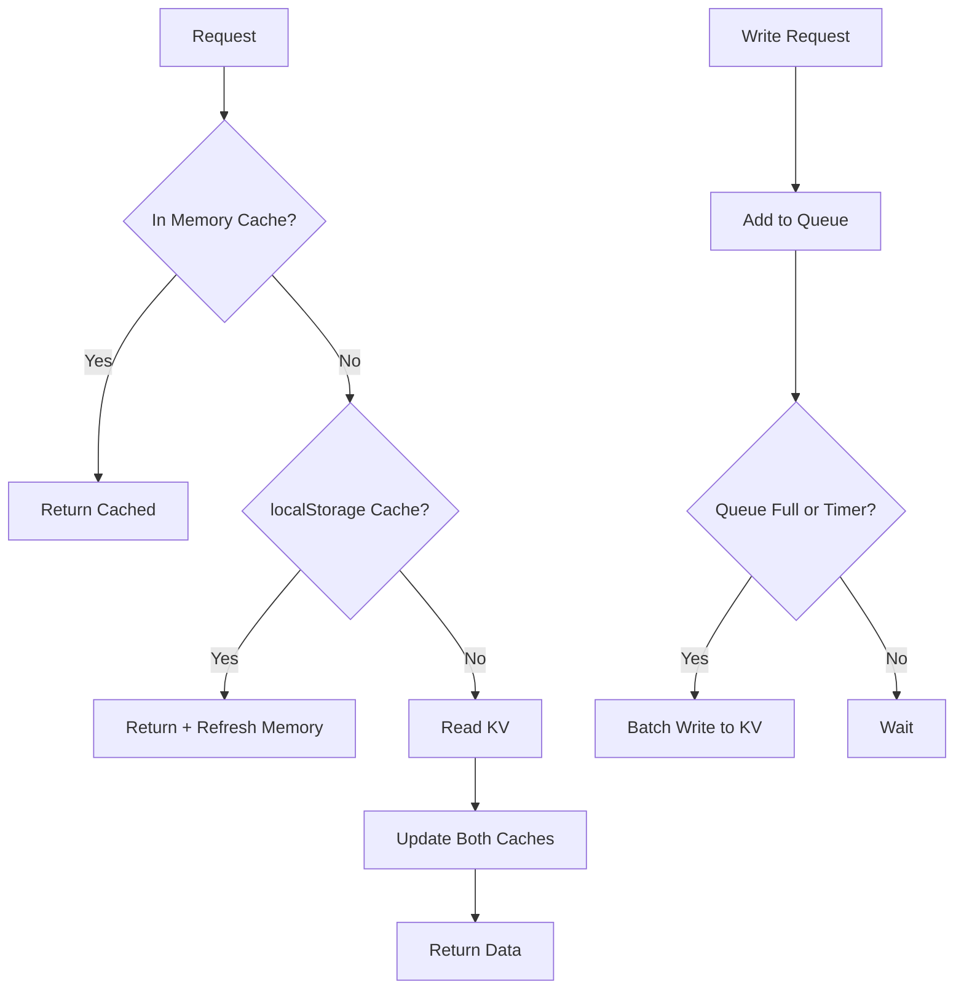

---

### 54. 1000 Track Limit Bug Fix
**Priority:** P0 | **Effort:** M | **Status:** ⏳ PENDING

```
PROBLEM STATEMENT:
Data not persisting for users with >1000 liked tracks. The current 1000 track
limit truncates libraries but doesn't properly save partial results.

USER STORY:
As a user with a large library, I want all my tracks to be scanned and saved
so that I can organise my complete collection.

REQUIREMENTS:
1. Implement paginated track fetching (50 per request, multiple rounds)
2. Store progress in KV for resume capability
3. Show progress indicator for large libraries
4. Handle rate limiting with exponential backoff
5. Save intermediate results to prevent data loss

FILES TO MODIFY:
- src/routes/api.ts (paginated fetching)
- src/lib/spotify.ts (rate limit handling)
- src/frontend/app.js (progress indicator)

IMPLEMENTATION DETAILS:
1. Fetch tracks in batches of 50
2. After each batch, update progress in KV: scan_progress:{userId}
3. If interrupted, resume from last saved offset
4. Show "Scanning: 1,500 of 3,200 tracks..." message
5. Maximum 10,000 tracks (200 requests) to stay within limits

ACCEPTANCE CRITERIA:
- [ ] Libraries up to 10,000 tracks fully scanned
- [ ] Progress persists across page refreshes
- [ ] Rate limits handled gracefully
- [ ] Intermediate results saved

TEST CASES:
1. User with 2,500 tracks → all scanned
2. Interrupt mid-scan → resume works
3. Hit rate limit → backoff + retry
4. Progress bar accurate

MERMAID DIAGRAM:
```

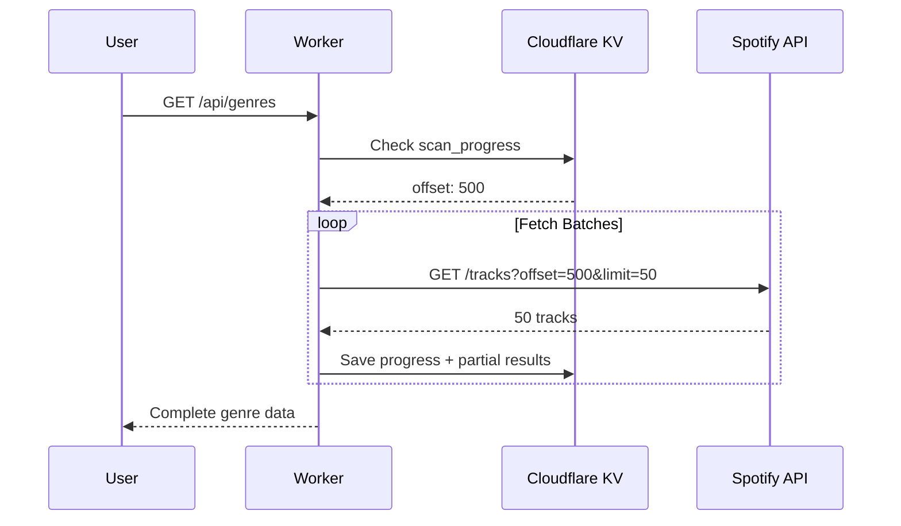

---

### 55. Sorted Scoreboard Tab Empty Fix
**Priority:** P0 | **Effort:** S | **Status:** ✅ DONE (v3.0.0)

```
PROBLEM STATEMENT:
The "Sorted" scoreboard tab shows empty because existing users don't have
totalTracksInPlaylists data - only newly created playlists get counted.

USER STORY:
As a user, I want to see accurate rankings in the Sorted tab so that I can
compare my playlist activity with others.

REQUIREMENTS:
1. Backfill existing user stats with totalTracksInPlaylists
2. Calculate from createdPlaylists array if available
3. Add migration script for one-time data fix
4. Ensure getScoreboard() returns byTracksInPlaylists correctly

FILES TO MODIFY:
- src/lib/session.ts (ensure field initialised)
- scripts/backfill-track-counts.mjs (new migration script)

IMPLEMENTATION DETAILS:
1. Script iterates all user_stats:* keys
2. For each user, check if totalTracksInPlaylists is 0 or undefined
3. If createdPlaylists exists, estimate tracks (playlist count × 25 avg)
4. Update user stats with calculated value

ACCEPTANCE CRITERIA:
- [ ] Sorted tab shows data
- [ ] Existing users have non-zero counts
- [ ] New users accumulate correctly

TEST CASES:
1. Run backfill → verify users have counts
2. Create new playlist → count increments
3. Sorted tab displays rankings
```

---

### 56. Mobile UI Fixes (Tiny Buttons/Arrows/Clocks)
**Priority:** P1 | **Effort:** M | **Status:** ✅ DONE (v3.0.0)

```
PROBLEM STATEMENT:
Mobile users report tiny, hard-to-tap buttons, arrows, and timestamp clocks.
Touch targets below 44px minimum recommended by Apple HIG.

USER STORY:
As a mobile user, I want buttons and icons to be easily tappable so that I can
use the app comfortably on my phone.

REQUIREMENTS:
1. Increase all touch targets to minimum 44×44px
2. Scale icons for mobile (min 24px)
3. Improve timestamp readability
4. Add mobile-specific spacing
5. Test on iPhone SE (smallest common screen)

FILES TO MODIFY:
- src/frontend/styles.css (media queries)

IMPLEMENTATION DETAILS:
1. Add @media (max-width: 768px) overrides
2. Increase button padding: 12px → 16px
3. Increase icon size: 16px → 24px
4. Increase font size for timestamps: 10px → 14px
5. Add touch-action: manipulation for faster taps

ACCEPTANCE CRITERIA:
- [ ] All buttons ≥44px touch target
- [ ] Icons clearly visible on mobile
- [ ] Timestamps readable
- [ ] No horizontal scroll

TEST CASES:
1. iPhone SE viewport → all buttons tappable
2. Fat finger test → no mis-taps
3. Timestamp visible without squinting

MERMAID DIAGRAM:
```

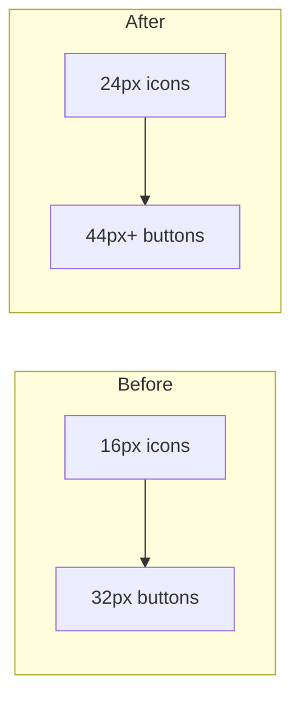

---

## Phase 2: Admin Panel & Documentation Infrastructure

### 57. Admin Debug Panel for tomspseudonym
**Priority:** P1 | **Effort:** XL | **Status:** ⏳ PENDING

```
PROBLEM STATEMENT:
No way to debug production issues without deploying code changes.
Need admin-only panel for monitoring, KV management, and impersonation.

USER STORY:
As tomspseudonym (admin), I want a debug panel so that I can diagnose and fix
issues without deploying code changes.

REQUIREMENTS:
1. Admin auth: detect spotifyId === 'tomspseudonym' OR specific admin list
2. Admin panel accessible via /admin or keyboard shortcut (Ctrl+Shift+A)
3. Sections:
   a. KV Browser - view/edit/delete keys
   b. User Impersonation - view app as another user
   c. Live Logs - recent requests/errors
   d. Stats Dashboard - KV usage, active users, errors
   e. Manual Actions - clear cache, reset user, force refresh
4. Secure: admin-only, audit log all actions

FILES TO CREATE:
- src/routes/admin.ts (admin API endpoints)
- src/frontend/admin.js (admin panel UI)
- src/frontend/admin.css (admin styles)

FILES TO MODIFY:
- src/index.ts (mount admin routes)
- src/lib/session.ts (add isAdmin check)

IMPLEMENTATION DETAILS:
1. isAdmin(userId: string): boolean - check against ADMIN_USERS array
2. AdminGuard middleware for all /admin/* routes
3. KV Browser: list keys, view values, edit (with confirmation), delete
4. Impersonation: temporary session override, banner "Viewing as @user"
5. Audit log: admin_audit:{timestamp} → { admin, action, target, details }

ACCEPTANCE CRITERIA:
- [ ] Admin panel accessible only to admins
- [ ] KV browser functional
- [ ] Impersonation works
- [ ] All actions logged
- [ ] Non-admins get 403

TEST CASES:
1. tomspseudonym → panel accessible
2. Regular user → 403 Forbidden
3. Edit KV value → change persists + logged
4. Impersonate user → see their view
5. Exit impersonation → back to admin view

MERMAID DIAGRAM:
```

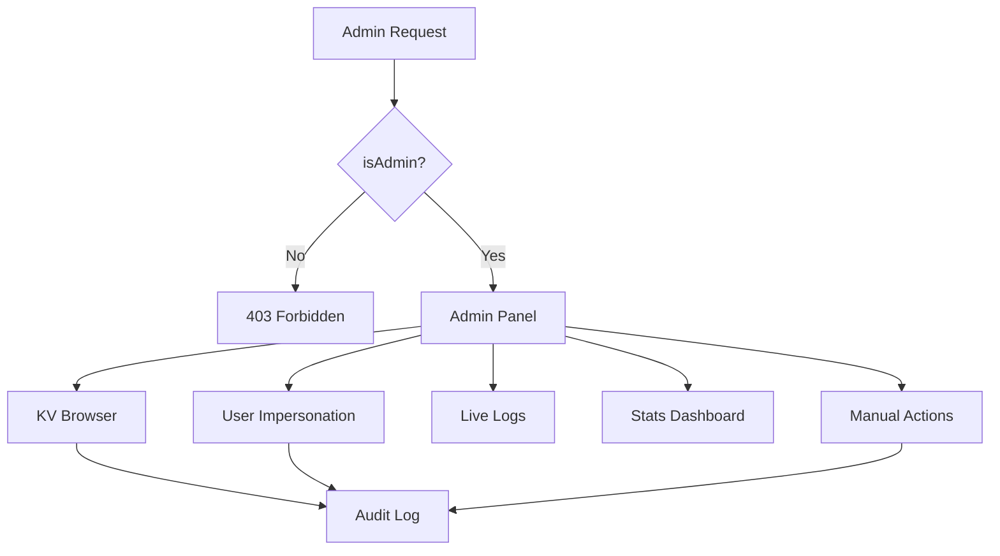

---

### 58. KV Monitoring Dashboard
**Priority:** P1 | **Effort:** L | **Status:** ⏳ PENDING

```
PROBLEM STATEMENT:
No visibility into KV usage, quota consumption, or operation patterns.
Can't proactively prevent quota exhaustion.

USER STORY:
As an admin, I want to see live KV statistics so that I can monitor usage
and prevent quota issues before they affect users.

REQUIREMENTS:
1. Track all KV operations with timestamps
2. Display live graphs: reads/hour, writes/hour, quota %
3. Export data as CSV for analysis
4. Alert thresholds: 70%, 80%, 90% quota
5. Show operation breakdown by key prefix

FILES TO CREATE:
- src/lib/kv-metrics.ts (metrics collection)

FILES TO MODIFY:
- src/routes/admin.ts (metrics endpoint)
- src/frontend/admin.js (dashboard UI)

IMPLEMENTATION DETAILS:
1. Wrap KV operations with metrics tracking
2. Store hourly aggregates: kv_metrics:{hour} → { reads, writes, keys }
3. Chart.js for live graphs
4. CSV export: timestamp, operation, key, latency

ACCEPTANCE CRITERIA:
- [ ] Real-time graphs updating
- [ ] Accurate operation counts
- [ ] Export functional
- [ ] Alerts trigger at thresholds

TEST CASES:
1. Perform 100 KV ops → graph shows spike
2. Export CSV → data accurate
3. Hit 70% quota → warning displayed

MERMAID DIAGRAM:
```

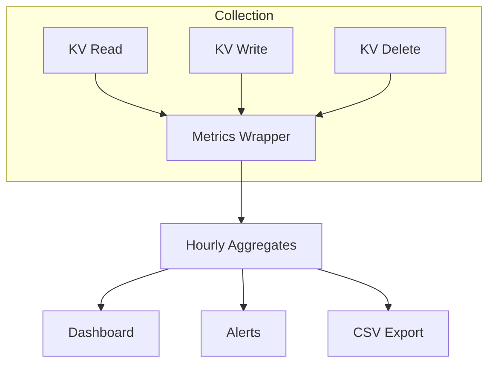

---

### 59. Documentation Infrastructure with Mermaid
**Priority:** P2 | **Effort:** M | **Status:** ⏳ PENDING

```
PROBLEM STATEMENT:
Documentation lacks visual diagrams. Mermaid diagrams help explain
architecture and flows but need proper rendering setup.

USER STORY:
As a developer, I want documentation with visual diagrams so that I can
quickly understand system architecture and data flows.

REQUIREMENTS:
1. Add Mermaid diagram support to markdown docs
2. Create architecture overview diagram
3. Create data flow diagrams for key features
4. Add diagrams to existing docs
5. PDF generation includes rendered diagrams

FILES TO CREATE:
- docs/architecture.md (with Mermaid diagrams)
- docs/data-flows.md (with Mermaid diagrams)

FILES TO MODIFY:
- scripts/build-docs.mjs (Mermaid rendering)
- docs/*.md (add diagrams)

IMPLEMENTATION DETAILS:
1. Use mermaid-cli for PDF rendering
2. GitHub renders Mermaid natively in markdown
3. Create diagrams:
   - System architecture
   - OAuth flow
   - Genre analysis pipeline
   - Playlist creation flow
   - KV data model

ACCEPTANCE CRITERIA:
- [ ] Mermaid renders in GitHub
- [ ] PDFs include rendered diagrams
- [ ] All major flows documented
- [ ] Architecture clear to new developers

MERMAID DIAGRAM (Example):
```

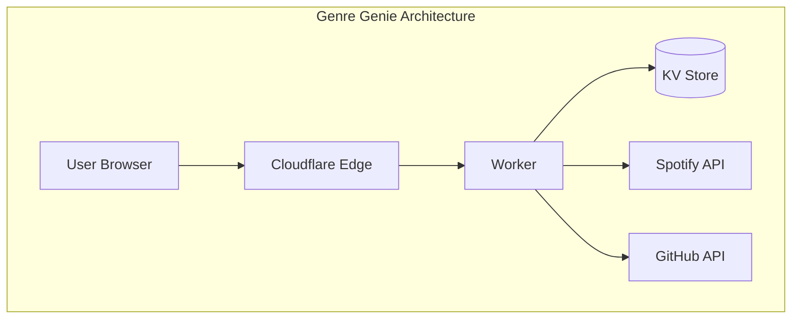

---

### 60. Automated Test Suite Expansion
**Priority:** P2 | **Effort:** L | **Status:** ⏳ PENDING

```
PROBLEM STATEMENT:
Test coverage incomplete. Need comprehensive tests for all features,
especially new v3.0 additions.

USER STORY:
As a developer, I want comprehensive tests so that I can refactor with
confidence and catch regressions early.

REQUIREMENTS:
1. Achieve 80%+ code coverage
2. Add integration tests for all API endpoints
3. Add E2E tests for critical user flows
4. Test Swedish mode translations
5. Test admin panel access control

FILES TO CREATE:
- tests/admin.test.ts (admin panel tests)
- tests/kv-cache.test.ts (caching tests)
- tests/integration.test.ts (API integration)

FILES TO MODIFY:
- vitest.config.ts (coverage settings)
- package.json (test scripts)

IMPLEMENTATION DETAILS:
1. Unit tests for all utility functions
2. Integration tests with mocked KV
3. Test matrix: English/Swedish × Light/Dark × Mobile/Desktop
4. Coverage report in CI

ACCEPTANCE CRITERIA:
- [ ] 80%+ line coverage
- [ ] All API endpoints tested
- [ ] Swedish translations tested
- [ ] Admin access control tested
- [ ] CI fails on coverage drop

TEST CASES:
See individual test files for cases.
```

---

## Phase 3: Heidi Features & UI/UX Improvements

### 61. Smoke Animation on Durry Button
**Priority:** P2 | **Effort:** M | **Status:** ✅ DONE (v3.0.0)

```
PROBLEM STATEMENT:
The "durry" (cigarette) donation button lacks visual flair.
User wants smoke wisps animation on hover.

USER STORY:
As a user hovering over the durry button, I want to see whimsical smoke
animation so that the Easter egg feels more polished and fun.

REQUIREMENTS:
1. CSS-only smoke wisps animation
2. Triggers on hover
3. Subtle, not distracting
4. Works in both light and dark mode
5. Respects prefers-reduced-motion

FILES TO MODIFY:
- src/frontend/styles.css (smoke animation)
- src/frontend/app.js (button markup)

IMPLEMENTATION DETAILS:
1. Create smoke wisps using CSS pseudo-elements
2. Animation: fade in, rise, fade out
3. 3-4 wisps at staggered intervals
4. Duration: 2-3 seconds loop
5. Opacity: start 0.3, end 0

ACCEPTANCE CRITERIA:
- [ ] Smoke animation on hover
- [ ] Smooth 60fps
- [ ] Works light/dark mode
- [ ] Disabled with reduced motion

CSS SKETCH:
```

```css
.durry-btn:hover::before {
  content: '~';
  position: absolute;
  animation: smoke 2s infinite;
}

@keyframes smoke {
  0% { opacity: 0.3; transform: translateY(0); }
  100% { opacity: 0; transform: translateY(-20px); }
}
```

---

### 62. Jeff Goldblum Easter Egg
**Priority:** P3 | **Effort:** M | **Status:** ✅ DONE (v3.1.0)

```
PROBLEM STATEMENT:
User wants a fun Jeff Goldblum Easter egg. "Life finds a way" moment
when something unexpected happens.

USER STORY:
As a user discovering an Easter egg, I want to see a Jeff Goldblum reference
so that I smile at the Jurassic Park homage.

REQUIREMENTS:
1. Trigger: Konami code OR finding a rare genre
2. Display: Goldblum silhouette with quote
3. Audio: Optional "Life, uh, finds a way" clip (off by default)
4. Animation: Fade in, stay 3s, fade out
5. Track discovery: once per session

FILES TO MODIFY:
- src/frontend/app.js (Easter egg logic)
- src/frontend/styles.css (Goldblum styling)

IMPLEMENTATION DETAILS:
1. Konami code listener: ↑↑↓↓←→←→BA
2. Goldblum SVG silhouette (minimalist)
3. Text: "Life, uh, finds a way. 🦖"
4. localStorage: goldblumSeen = true
5. Play sound only if user has interacted (browser policy)

ACCEPTANCE CRITERIA:
- [ ] Konami code triggers Easter egg
- [ ] Displays correctly
- [ ] Shows once per session
- [ ] Audio optional and respects browser policy
```

---

### 63. Music Taste Analysis Redesign
**Priority:** P2 | **Effort:** L | **Status:** ⏳ PENDING

```
PROBLEM STATEMENT:
Current genre display is functional but not visually engaging.
User wants a more interesting visualisation of their music taste.

USER STORY:
As a user, I want an engaging visualisation of my music taste so that
I can appreciate the diversity (or lack thereof) in my library.

REQUIREMENTS:
1. Genre bubble chart or tree map
2. Interactive: click genre to see tracks
3. Colour-coded by genre family
4. Size = track count
5. Animated entrance

FILES TO MODIFY:
- src/frontend/app.js (visualisation component)
- src/frontend/styles.css (chart styles)

IMPLEMENTATION DETAILS:
1. D3.js for bubble chart OR pure CSS grid
2. Genre families: rock, pop, electronic, hip-hop, etc.
3. Colour palette per family
4. Hover: show exact count and artists
5. Click: expand to track list

ACCEPTANCE CRITERIA:
- [ ] Visual is engaging and clear
- [ ] Interactive hover/click
- [ ] Performs well with 50+ genres
- [ ] Mobile responsive

MERMAID DIAGRAM:
```

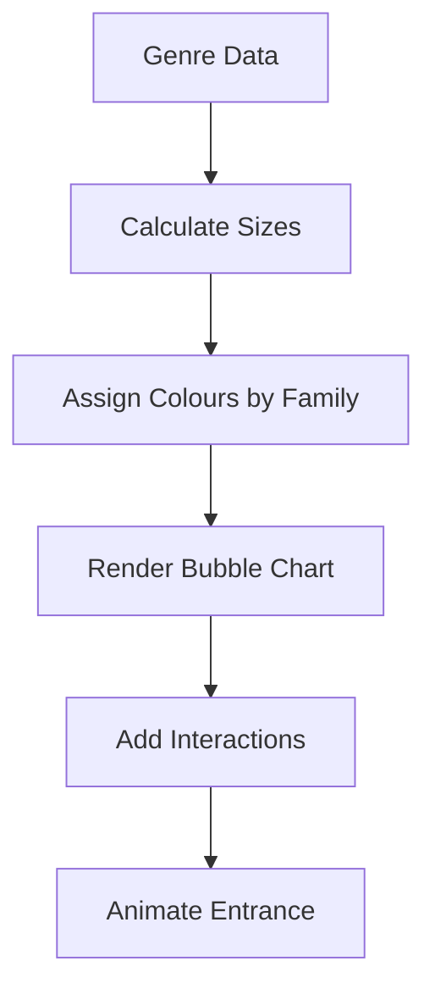

---

### 64. SECRET Heidi Features (~oogi~ Detection)
**Priority:** P1 | **Effort:** M | **Status:** ✅ DONE (v3.2.0)

```
PROBLEM STATEMENT:
Special features for Heidi need to be implemented secretly.
DO NOT document in public files - this is just for internal tracking.

USER STORY:
As Heidi (~oogi~), I want special romantic touches so that I feel loved
when using the app Tom built for me.

REQUIREMENTS:
1. Detect user: spotifyId contains 'oogi' OR display name contains 'Heidi'
2. Special greeting: "Välkommen tillbaka, min drottning 👑"
3. Queen crown animation in header
4. Personal message on first load of day
5. Swedish mode auto-enabled for Heidi

FILES TO MODIFY:
- src/frontend/app.js (detection + special rendering)
- src/lib/session.ts (Heidi flag in session)

IMPLEMENTATION DETAILS:
1. isHeidi(user): boolean - check id/name
2. If Heidi: add 'heidi-mode' class to body
3. Crown animation: CSS sparkle effect
4. Messages rotate daily from preset list
5. Heart particles on playlist creation

ACCEPTANCE CRITERIA:
- [ ] Heidi detected correctly
- [ ] Special greeting displays
- [ ] Crown animation works
- [ ] Not visible to other users
- [ ] Swedish auto-enabled

NOTE: This task details kept internal, not in public docs.
```

---

## Phase 4: User Profiles & Registration System

### 65. User Activity Status (Green/Blue Indicators)
**Priority:** P2 | **Effort:** M | **Status:** ⏳ PENDING

```
PROBLEM STATEMENT:
No way to see if other users are active or listening.
User wants green dot (listening) and blue dot (active) indicators.

USER STORY:
As a user, I want to see who's currently active so that the community
feels more alive and connected.

REQUIREMENTS:
1. Green dot: Currently listening on Spotify
2. Blue dot: Active in app (last 5 min)
3. Grey dot: Inactive
4. Real-time updates via polling
5. Privacy: Users can opt out

FILES TO MODIFY:
- src/routes/api.ts (activity endpoint)
- src/lib/session.ts (track last active)
- src/frontend/app.js (status indicators)
- src/frontend/styles.css (dot styles)

IMPLEMENTATION DETAILS:
1. Store lastActive timestamp on each request
2. Check Spotify currently-playing endpoint (if scope granted)
3. Endpoint: GET /api/users/status?ids=id1,id2,id3
4. Response: { id: { status: 'listening'|'active'|'inactive', track?: {} }}
5. Polling: every 30 seconds for visible users

ACCEPTANCE CRITERIA:
- [ ] Green dot when listening
- [ ] Blue dot when active
- [ ] Grey when inactive
- [ ] Updates in real-time
- [ ] Opt-out works

MERMAID DIAGRAM:
```

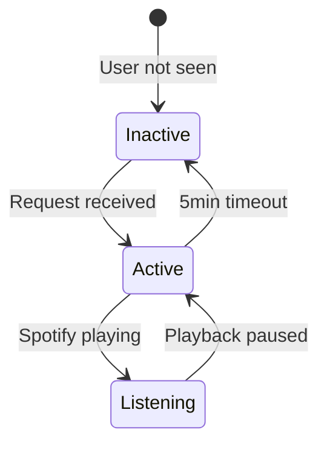

---

### 66. User Profile Cards
**Priority:** P2 | **Effort:** L | **Status:** ⏳ PENDING

```
PROBLEM STATEMENT:
Users in leaderboard/scoreboard are just names. Want profile cards
showing stats and activity.

USER STORY:
As a user, I want to see profile cards for other users so that I can
learn about their music taste and activity.

REQUIREMENTS:
1. Click username → profile card popup
2. Show: avatar, name, join date, stats
3. Stats: genres discovered, playlists created, top genre
4. Recent playlists by this user
5. Respect privacy settings

FILES TO MODIFY:
- src/routes/api.ts (GET /api/users/:id/profile)
- src/frontend/app.js (profile card component)
- src/frontend/styles.css (card styles)

IMPLEMENTATION DETAILS:
1. Endpoint returns public stats only
2. Card position: next to clicked element
3. Animation: fade + scale in
4. Close: click outside or X button
5. Link to Spotify profile (if public)

ACCEPTANCE CRITERIA:
- [ ] Profile card displays
- [ ] Stats accurate
- [ ] Recent playlists shown
- [ ] Privacy respected
- [ ] Mobile responsive

MERMAID DIAGRAM:
```

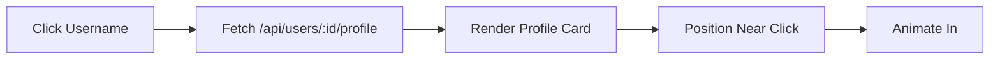

---

### 67. User Registration/Approval System
**Priority:** P3 | **Effort:** XL | **Status:** ⏳ PENDING

```
PROBLEM STATEMENT:
Currently anyone with Spotify can use the app. Want optional
registration gate for controlled access.

USER STORY:
As an admin, I want to approve new users so that I can control who
accesses the app during beta/private phases.

REQUIREMENTS:
1. Config flag: REGISTRATION_MODE = 'open' | 'approval' | 'closed'
2. Approval mode: new users see "Request Access" form
3. Admin receives notification of pending requests
4. Admin approves/denies via panel
5. Approved users notified via email (if provided)

FILES TO CREATE:
- src/routes/registration.ts (registration endpoints)

FILES TO MODIFY:
- src/routes/auth.ts (registration check)
- src/routes/admin.ts (approval endpoints)
- src/frontend/app.js (request form)

IMPLEMENTATION DETAILS:
1. KV: registration_requests:{spotifyId} → { name, email?, requestedAt, status }
2. On login, check if approved (or open mode)
3. Admin panel: list pending, approve/deny buttons
4. Webhook to Discord/Slack for notifications (optional)

ACCEPTANCE CRITERIA:
- [ ] Open mode: works as before
- [ ] Approval mode: gate works
- [ ] Admin can approve/deny
- [ ] User notified of decision
- [ ] Closed mode: no new registrations

MERMAID DIAGRAM:
```

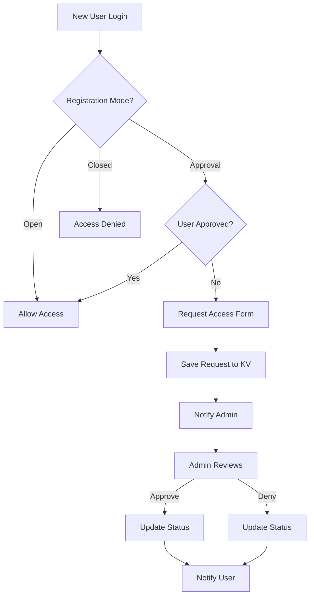

---

## Phase 5: Playlist Overhaul & Polish

### 68. Playlist Preview Before Creation
**Priority:** P2 | **Effort:** M | **Status:** ✅ DONE (v3.0.0)

```
PROBLEM STATEMENT:
Users can't see what tracks will be in a playlist before creating it.
Want preview with ability to add/remove tracks.

USER STORY:
As a user, I want to preview playlist contents before creating so that
I can exclude tracks I don't want.

REQUIREMENTS:
1. "Preview" button on genre card
2. Modal showing all tracks in genre
3. Checkbox to include/exclude each track
4. "Select All" / "Deselect All" buttons
5. Track count updates live
6. Create button uses selected tracks only

FILES TO MODIFY:
- src/frontend/app.js (preview modal)
- src/frontend/styles.css (modal styles)
- src/routes/api.ts (accept track IDs array)

IMPLEMENTATION DETAILS:
1. Preview fetches track details (name, artist, album art)
2. Virtual scroll for large lists (100+ tracks)
3. Search within preview to find tracks
4. State: Set<trackId> for selected
5. API accepts { genre, trackIds: string[] }

ACCEPTANCE CRITERIA:
- [ ] Preview shows all tracks
- [ ] Selection works
- [ ] Count updates live
- [ ] Large lists performant
- [ ] Created playlist has correct tracks

MERMAID DIAGRAM:
```

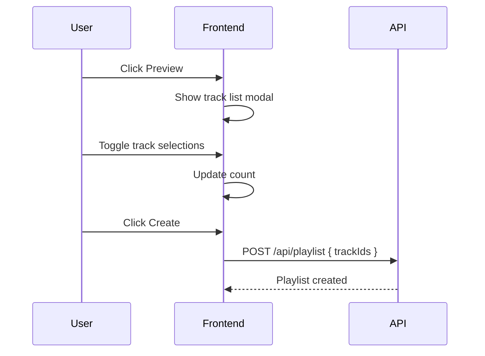

---

### 69. Multi-Genre Playlist Merge
**Priority:** P3 | **Effort:** M | **Status:** ⏳ PENDING

```
PROBLEM STATEMENT:
Can only create single-genre playlists. Want to merge multiple genres
into one playlist.

USER STORY:
As a user, I want to combine genres into one playlist so that I can
create custom mixes like "Rock + Metal + Punk".

REQUIREMENTS:
1. Multi-select genres (checkbox)
2. "Merge into One" button when 2+ selected
3. Custom name input (default: "Genre1 + Genre2 + ...")
4. Deduplicate tracks across genres
5. Show combined track count

FILES TO MODIFY:
- src/frontend/app.js (merge UI)
- src/routes/api.ts (accept multiple genres)

IMPLEMENTATION DETAILS:
1. Track selection state: Set<genreName>
2. Compute merged tracks: union of all genre tracks
3. Dedupe by trackId
4. Playlist description: "Merged from: rock, metal, punk"

ACCEPTANCE CRITERIA:
- [ ] Multi-select works
- [ ] Merge button appears at 2+ genres
- [ ] Custom name works
- [ ] Tracks deduplicated
- [ ] Description accurate
```

---

### 70. Custom Playlist Cover Art
**Priority:** P3 | **Effort:** M | **Status:** ⏳ PENDING

```
PROBLEM STATEMENT:
Playlists use Spotify's auto-generated cover. Want custom cover option.

USER STORY:
As a user, I want to set custom cover art so that my playlists are
visually distinctive.

REQUIREMENTS:
1. Upload image or paste URL
2. Preview before applying
3. Validate: JPEG, max 256KB
4. Apply after playlist creation (Spotify API requirement)
5. Generate from genre (stretch goal)

FILES TO MODIFY:
- src/frontend/app.js (upload UI in create modal)
- src/routes/api.ts (set playlist image endpoint)
- src/lib/spotify.ts (PUT /playlists/{id}/images)

IMPLEMENTATION DETAILS:
1. File input: accept="image/jpeg"
2. Client-side resize if >256KB
3. Convert to base64
4. After playlist creation, call setPlaylistImage()
5. Spotify requires base64 JPEG, no header

ACCEPTANCE CRITERIA:
- [ ] Upload works
- [ ] URL input works
- [ ] Preview displays
- [ ] Image appears on Spotify
- [ ] Large images resized

MERMAID DIAGRAM:
```

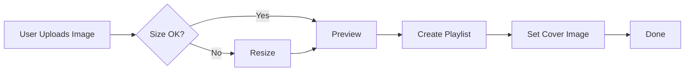

---

### 71. Swedish Release Names & Versioning
**Priority:** P3 | **Effort:** S | **Status:** ✅ DONE (v3.4.0)

```
PROBLEM STATEMENT:
Version numbers are boring. User wants Swedish codenames for releases.

USER STORY:
As a user checking the version, I want to see Swedish codenames so that
releases feel more personal and on-brand.

REQUIREMENTS:
1. Each version has Swedish codename
2. Display: "v3.0.0 - Förtrollad (Enchanted)"
3. Codenames: Swedish words related to features
4. Update changelog format
5. Show in footer and version widget

FILES TO MODIFY:
- src/routes/api.ts (changelog format)
- src/frontend/app.js (version display)

IMPLEMENTATION DETAILS:
1. Codename list:
   - v3.0: Förtrollad (Enchanted)
   - v3.1: Äventyr (Adventure)
   - v3.2: Skymning (Twilight)
   - etc.
2. Store in APP_VERSION_NAME constant
3. Display: APP_VERSION + ' - ' + APP_VERSION_NAME

ACCEPTANCE CRITERIA:
- [ ] Swedish codename shown
- [ ] Changelog updated
- [ ] Footer displays correctly
```

---

### 72. BetterStack Status Page Integration
**Priority:** P2 | **Effort:** M | **Status:** ⏳ PENDING

```
PROBLEM STATEMENT:
No public status page for users to check if issues are on their end
or service-wide.

USER STORY:
As a user experiencing issues, I want to check a status page so that
I know if the problem is my connection or the service.

REQUIREMENTS:
1. Create BetterStack status page
2. Link from app footer
3. Show uptime badge in app
4. Configure incident notifications
5. Maintenance mode integration

FILES TO MODIFY:
- src/frontend/app.js (status link + badge)
- .github/workflows/deploy.yml (maintenance mode)

IMPLEMENTATION DETAILS:
1. Use provided BetterStack credentials
2. Create status page via API
3. Add monitors (per task #46)
4. Embed uptime badge
5. On deploy: set maintenance mode, deploy, clear maintenance

ACCEPTANCE CRITERIA:
- [ ] Status page live
- [ ] Link in footer
- [ ] Badge shows uptime
- [ ] Maintenance mode works

MERMAID DIAGRAM:
```

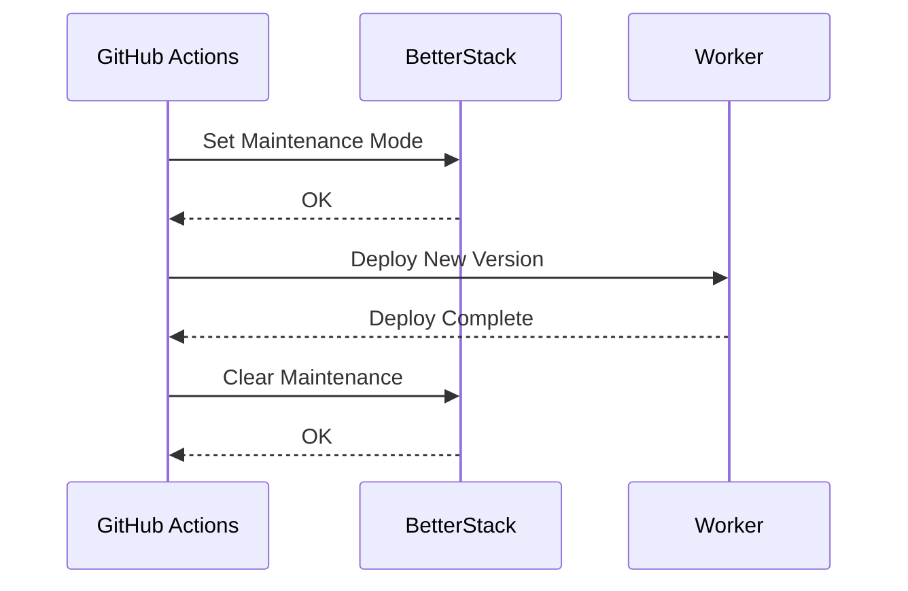

---

## Phase Summary

| Phase | Tasks | Priority Focus | Estimated Complexity |
|-------|-------|----------------|---------------------|
| 1 | 53-56 | P0-P1 Critical fixes | High - Core stability |
| 2 | 57-60 | P1-P2 Infrastructure | High - Admin tooling |
| 3 | 61-64 | P1-P3 UX & Heidi | Medium - Polish |
| 4 | 65-67 | P2-P3 Social | High - New systems |
| 5 | 68-72 | P2-P3 Features | Medium - Enhancements |

---

## Implementation Order

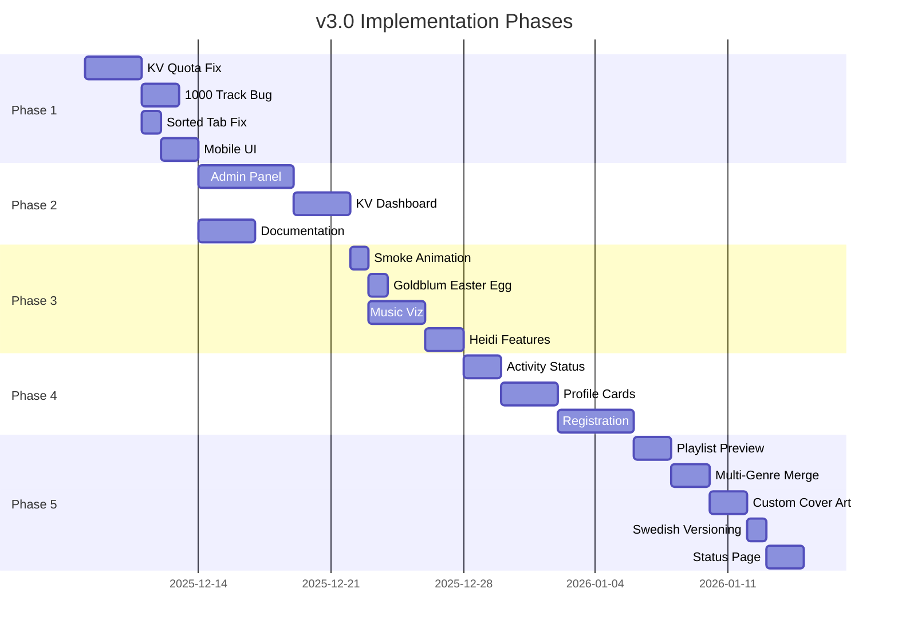

---

---

## Additional Tasks (Continued)

### 73. Scan Playlists Feature
**Priority:** P2 | **Effort:** L | **Status:** ⏳ PENDING

```
PROBLEM STATEMENT:
Users can only scan liked songs. Want to analyse genres from any playlist.

USER STORY:
As a user, I want to scan any of my playlists so that I can analyse genre
distribution across different collections.

REQUIREMENTS:
1. "Scan Playlist" dropdown/selector
2. List user's playlists with track counts
3. Analyse genres from selected playlist
4. Compare with liked songs results
5. Create sub-playlists from playlist

FILES TO MODIFY:
- src/routes/api.ts (GET /api/playlists, POST /api/genres with playlistId)
- src/lib/spotify.ts (getPlaylistTracks)
- src/frontend/app.js (playlist selector UI)

ACCEPTANCE CRITERIA:
- [ ] User playlists listed
- [ ] Can select and scan any playlist
- [ ] Results comparable to liked songs
- [ ] Works with collaborative playlists
```

---

### 74. Persistent Genre Cache
**Priority:** P1 | **Effort:** M | **Status:** ⏳ PENDING

```
PROBLEM STATEMENT:
Genre data fetched fresh every session, wasting API calls and KV quota.

USER STORY:
As a user, I want my genre data cached so that repeated visits load instantly.

REQUIREMENTS:
1. Cache genre results in KV per user
2. TTL: 24 hours (refresh daily or on demand)
3. Show "cached" indicator with timestamp
4. Manual refresh button
5. Invalidate on new liked songs

FILES TO MODIFY:
- src/routes/api.ts (cache logic)
- src/lib/session.ts (cache helpers)
- src/frontend/app.js (cache indicator + refresh)

ACCEPTANCE CRITERIA:
- [ ] Subsequent loads use cache
- [ ] Cache indicator visible
- [ ] Manual refresh works
- [ ] Auto-invalidates correctly
```

---

### 75. Library Size Display
**Priority:** P2 | **Effort:** S | **Status:** ⏳ PENDING

```
PROBLEM STATEMENT:
Users don't know their library size until scan completes.

USER STORY:
As a user, I want to see my library size upfront so that I know what to expect.

REQUIREMENTS:
1. Fetch library total on session start
2. Display: "Your library: 2,345 tracks"
3. Estimate scan time based on size
4. Warning for large libraries (>5000)

FILES TO MODIFY:
- src/routes/api.ts (library count endpoint)
- src/frontend/app.js (display logic)

ACCEPTANCE CRITERIA:
- [ ] Library size shown before scan
- [ ] Estimate accurate
- [ ] Warning for large libraries
```

---

### 76. Progressive Scan with Resume
**Priority:** P1 | **Effort:** L | **Status:** ⏳ PENDING

```
PROBLEM STATEMENT:
Large library scans timeout or fail, losing all progress.

USER STORY:
As a user with a large library, I want scans to be resumable so that I don't
lose progress if something goes wrong.

REQUIREMENTS:
1. Save progress every 500 tracks
2. Resume from last checkpoint on reload
3. "Continue Scan" prompt if incomplete
4. Progress: "Phase 2/4: Analysing artists..."
5. Background scan option

FILES TO MODIFY:
- src/routes/api.ts (checkpoint logic)
- src/lib/session.ts (progress storage)
- src/frontend/app.js (resume UI)

ACCEPTANCE CRITERIA:
- [ ] Progress persists across sessions
- [ ] Resume continues from checkpoint
- [ ] Clear progress indication
- [ ] Background mode works
```

---

### 77. Duplicate Track Detection
**Priority:** P3 | **Effort:** M | **Status:** ⏳ PENDING

```
PROBLEM STATEMENT:
Users may have duplicate tracks in liked songs (same song, different albums).

USER STORY:
As a user, I want to see duplicate tracks so that I can clean up my library.

REQUIREMENTS:
1. Detect same track name + artist
2. List duplicates with reasons (live/remaster/etc)
3. Option to exclude duplicates from playlists
4. Quick-remove duplicates feature

FILES TO MODIFY:
- src/routes/api.ts (duplicate detection)
- src/frontend/app.js (duplicates UI)

ACCEPTANCE CRITERIA:
- [ ] Duplicates detected
- [ ] Reasons shown
- [ ] Can exclude from playlists
- [ ] Remove feature works
```

---

### 78. Artist Deep Dive
**Priority:** P3 | **Effort:** M | **Status:** ✅ DONE (v3.4.0)

```
PROBLEM STATEMENT:
Users see genres but don't know which artists contribute to each.

USER STORY:
As a user, I want to see which artists are in each genre so that I understand
my music taste better.

REQUIREMENTS:
1. Click genre → show top artists in that genre
2. Artist photos and track counts
3. Link to Spotify artist page
4. "Create artist-focused playlist" option

FILES TO MODIFY:
- src/routes/api.ts (artist breakdown endpoint)
- src/frontend/app.js (artist modal)

ACCEPTANCE CRITERIA:
- [ ] Artists listed per genre
- [ ] Correct track counts
- [ ] Links work
- [ ] Artist playlist creation works
```

---

### 79. Genre Family Grouping
**Priority:** P2 | **Effort:** M | **Status:** ✅ DONE (v3.4.0)

```
PROBLEM STATEMENT:
Too many micro-genres (e.g., "australian rock", "classic rock", "hard rock").
Users want grouped view.

USER STORY:
As a user, I want to see genres grouped by family so that I can understand
the bigger picture of my taste.

REQUIREMENTS:
1. Genre taxonomy mapping (rock → subgenres)
2. Collapsible genre families
3. "Create family playlist" (all rock subgenres)
4. Toggle between flat/grouped views

FILES TO MODIFY:
- src/lib/genres.ts (taxonomy mapping)
- src/frontend/app.js (grouped view)
- src/frontend/styles.css (collapsible styles)

ACCEPTANCE CRITERIA:
- [ ] Genres grouped correctly
- [ ] Collapse/expand works
- [ ] Family playlist works
- [ ] Toggle between views
```

---

### 80. Smart Playlist Suggestions
**Priority:** P3 | **Effort:** L | **Status:** ⏳ PENDING

```
PROBLEM STATEMENT:
Users don't know which playlists to create. Want AI-like suggestions.

USER STORY:
As a user, I want smart playlist suggestions so that I discover interesting
combinations I wouldn't think of.

REQUIREMENTS:
1. Analyse user's genre spread
2. Suggest: "Try 'chill electronic' - you have 45 matching tracks!"
3. Mood-based suggestions (energetic, melancholic, etc)
4. Time-based suggestions (morning/evening vibes)

FILES TO MODIFY:
- src/routes/api.ts (suggestions endpoint)
- src/frontend/app.js (suggestions UI)

ACCEPTANCE CRITERIA:
- [ ] Relevant suggestions generated
- [ ] One-click create from suggestion
- [ ] Mood categories work
- [ ] Time-based works
```

---

### 81. Vinyl Loading Animation (Enhanced)
**Priority:** P2 | **Effort:** M | **Status:** ✅ DONE (v3.3.0)

```
PROBLEM STATEMENT:
Loading screen needs vinyl flip animation with album art.

USER STORY:
As a user waiting for scan, I want to see my album art flipping like vinyl
records so that the wait is entertaining.

REQUIREMENTS:
1. 3D CSS vinyl flip effect
2. Show actual album art from user's tracks
3. Genre names cycle below
4. Smooth 60fps animation
5. Mobile-optimised (reduce complexity)

FILES TO MODIFY:
- src/frontend/app.js (loading component)
- src/frontend/styles.css (vinyl animation)

ACCEPTANCE CRITERIA:
- [ ] Vinyl flips smoothly
- [ ] User's album art displayed
- [ ] Works on mobile
- [ ] Genre names cycle

CSS REFERENCE:
```

```css
.vinyl-container {
  perspective: 1000px;
}
.vinyl {
  transform-style: preserve-3d;
  animation: flip 3s infinite;
}
@keyframes flip {
  0%, 100% { transform: rotateY(0deg); }
  50% { transform: rotateY(180deg); }
}
```

---

### 82. Confetti Celebration
**Priority:** P3 | **Effort:** S | **Status:** ✅ DONE (v3.0.0)

```
PROBLEM STATEMENT:
Playlist creation success feels anticlimactic.

USER STORY:
As a user creating a playlist, I want celebration animation so that success
feels rewarding.

REQUIREMENTS:
1. Confetti burst on playlist create success
2. Colours match theme (Spotify green, Swedish yellow/blue if swedish mode)
3. 2-second duration
4. Respects prefers-reduced-motion
5. Sound effect (optional, off by default)

FILES TO MODIFY:
- src/frontend/app.js (celebration trigger)
- src/frontend/styles.css (confetti animation)

ACCEPTANCE CRITERIA:
- [ ] Confetti triggers on success
- [ ] Theme-appropriate colours
- [ ] Reduced motion respected
- [ ] Not annoying on repeat
```

---

### 83. Keyboard Shortcuts Enhancement
**Priority:** P2 | **Effort:** S | **Status:** ⏳ PENDING

```
PROBLEM STATEMENT:
Existing keyboard shortcuts need expansion and discoverability.

USER STORY:
As a power user, I want comprehensive keyboard shortcuts so that I can
navigate quickly.

REQUIREMENTS:
1. Add missing shortcuts:
   - / = focus search
   - g then h = go home
   - g then s = go scoreboard
   - c = create selected playlist
   - ? = show shortcut help
2. Shortcut overlay (press ?)
3. Vim-style navigation (j/k for up/down)

FILES TO MODIFY:
- src/frontend/app.js (keyboard handlers)
- src/frontend/styles.css (help overlay)

ACCEPTANCE CRITERIA:
- [ ] All shortcuts work
- [ ] Help overlay accessible
- [ ] Vim navigation works
- [ ] No conflicts with browser
```

---

### 84. Accessibility Audit & Fixes
**Priority:** P1 | **Effort:** L | **Status:** ⏳ PENDING

```
PROBLEM STATEMENT:
App not fully WCAG compliant. Needs accessibility improvements.

USER STORY:
As a user with disabilities, I want the app to be fully accessible so that
I can use it with assistive technology.

REQUIREMENTS:
1. Run Lighthouse accessibility audit
2. Fix all WCAG AA violations
3. Add ARIA labels to all interactive elements
4. Ensure keyboard navigation complete
5. Screen reader testing
6. Colour contrast fixes (especially light mode)

FILES TO MODIFY:
- src/frontend/app.js (ARIA labels)
- src/frontend/styles.css (contrast fixes)

ACCEPTANCE CRITERIA:
- [ ] Lighthouse accessibility 95+
- [ ] Screen reader usable
- [ ] Full keyboard navigation
- [ ] Contrast ratios 4.5:1+
```

---

### 85. Internationalisation Framework
**Priority:** P3 | **Effort:** L | **Status:** ⏳ PENDING

```
PROBLEM STATEMENT:
Only English and Swedish supported. Want framework for more languages.

USER STORY:
As a non-English speaker, I want the app in my language so that I can
understand all features.

REQUIREMENTS:
1. i18n framework (simple JSON files)
2. Language switcher in settings
3. Auto-detect browser language
4. Priority languages: EN, SV, DE, FR, ES
5. Community contribution instructions

FILES TO CREATE:
- src/i18n/en.json
- src/i18n/sv.json
- src/lib/i18n.ts

FILES TO MODIFY:
- src/frontend/app.js (i18n integration)

ACCEPTANCE CRITERIA:
- [ ] Framework functional
- [ ] EN and SV complete
- [ ] Language switching works
- [ ] Auto-detection works
```

---

### 86. Dark Mode Improvements
**Priority:** P2 | **Effort:** S | **Status:** ⏳ PENDING

```
PROBLEM STATEMENT:
Dark mode has some contrast issues and inconsistent styling.

USER STORY:
As a user preferring dark mode, I want consistent styling so that the
experience is polished.

REQUIREMENTS:
1. Audit all dark mode colours
2. Ensure sufficient contrast
3. Consistent border colours
4. Proper focus indicators
5. Match Spotify's dark theme aesthetic

FILES TO MODIFY:
- src/frontend/styles.css (dark mode variables)

ACCEPTANCE CRITERIA:
- [ ] All elements properly styled
- [ ] Contrast meets WCAG
- [ ] Focus visible
- [ ] Spotify-like feel
```

---

### 87. Error Boundary & Recovery
**Priority:** P1 | **Effort:** M | **Status:** ⏳ PENDING

```
PROBLEM STATEMENT:
Errors crash the entire app. Need graceful error handling.

USER STORY:
As a user encountering an error, I want clear feedback and recovery options
so that I'm not stuck.

REQUIREMENTS:
1. Global error boundary
2. User-friendly error messages
3. "Try Again" button
4. "Report Issue" link
5. Error details collapsible (for debugging)
6. Auto-report critical errors

FILES TO MODIFY:
- src/frontend/app.js (error boundary)
- src/routes/api.ts (error responses)

ACCEPTANCE CRITERIA:
- [ ] Errors don't crash app
- [ ] Clear user messages
- [ ] Recovery options work
- [ ] Issue reporting works
```

---

### 88. Offline Mode (Basic)
**Priority:** P3 | **Effort:** L | **Status:** ⏳ PENDING

```
PROBLEM STATEMENT:
App completely fails without network. Want basic offline support.

USER STORY:
As a user with spotty connection, I want cached data to work offline so that
I can still view my genres.

REQUIREMENTS:
1. Cache genre data in localStorage
2. Show cached results when offline
3. Clear "offline" indicator
4. Queue playlist creation for when online
5. Sync when connection returns

FILES TO MODIFY:
- src/frontend/app.js (offline handling)
- src/frontend/styles.css (offline indicator)

ACCEPTANCE CRITERIA:
- [ ] Cached data loads offline
- [ ] Offline indicator shows
- [ ] Queued actions sync
- [ ] Clear online/offline transition
```

---

### 89. Playlist History
**Priority:** P2 | **Effort:** M | **Status:** ⏳ PENDING

```
PROBLEM STATEMENT:
Users can't see what playlists they've created through the app.

USER STORY:
As a user, I want to see my playlist creation history so that I can find
and manage playlists I've made.

REQUIREMENTS:
1. Store created playlists per user in KV
2. "My Playlists" section showing history
3. Links to Spotify playlists
4. Delete from history option
5. Recreation option (if original deleted)

FILES TO MODIFY:
- src/lib/session.ts (playlist history storage)
- src/routes/api.ts (history endpoint)
- src/frontend/app.js (history UI)

ACCEPTANCE CRITERIA:
- [ ] History stored
- [ ] All created playlists listed
- [ ] Links work
- [ ] Recreation works
```

---

### 90. Share Playlist Modal
**Priority:** P3 | **Effort:** S | **Status:** ✅ DONE (v3.4.0)

```
PROBLEM STATEMENT:
After creating playlist, users want to share easily.

USER STORY:
As a user, I want to easily share my new playlist so that friends can
enjoy it too.

REQUIREMENTS:
1. Share modal after creation
2. Copy link button
3. QR code generation
4. Social share buttons (Twitter, Facebook)
5. Close and view playlist options

FILES TO MODIFY:
- src/frontend/app.js (share modal)
- src/frontend/styles.css (modal styles)

ACCEPTANCE CRITERIA:
- [ ] Modal appears after create
- [ ] Copy link works
- [ ] QR code generates
- [ ] Social buttons work
```

---

### 91. Playlist Description Templates
**Priority:** P2 | **Effort:** S | **Status:** ⏳ PENDING

```
PROBLEM STATEMENT:
Playlist descriptions are generic. Want customisable templates.

USER STORY:
As a user, I want customisable description templates so that my playlists
have personalised descriptions.

REQUIREMENTS:
1. Template syntax: {genre}, {count}, {date}, {username}
2. Default template with placeholders
3. Custom template saved in settings
4. Preview before creation

FILES TO MODIFY:
- src/routes/api.ts (template rendering)
- src/frontend/app.js (template editor)

ACCEPTANCE CRITERIA:
- [ ] Placeholders replaced correctly
- [ ] Custom templates saved
- [ ] Preview accurate
```

---

### 92. Batch Playlist Creation
**Priority:** P2 | **Effort:** M | **Status:** ⏳ PENDING

```
PROBLEM STATEMENT:
Creating multiple playlists is tedious. Want bulk creation.

USER STORY:
As a user, I want to create multiple playlists at once so that I can
quickly organise my library.

REQUIREMENTS:
1. Select multiple genres (existing)
2. "Create All Selected" button
3. Progress indicator for batch
4. Handle failures gracefully
5. Summary when complete

FILES TO MODIFY:
- src/routes/api.ts (bulk creation endpoint)
- src/frontend/app.js (batch UI)

ACCEPTANCE CRITERIA:
- [ ] Batch creation works
- [ ] Progress shown
- [ ] Failures don't stop batch
- [ ] Summary accurate
```

---

### 93. User Preferences Sync
**Priority:** P3 | **Effort:** M | **Status:** ⏳ PENDING

```
PROBLEM STATEMENT:
Preferences (theme, Swedish mode, etc) don't sync across devices.

USER STORY:
As a user with multiple devices, I want my preferences synced so that
the experience is consistent.

REQUIREMENTS:
1. Store preferences in KV per user
2. Sync on login
3. Local override option
4. Preferences: theme, swedish mode, hidden genres, templates

FILES TO MODIFY:
- src/lib/session.ts (preferences storage)
- src/frontend/app.js (sync logic)

ACCEPTANCE CRITERIA:
- [ ] Preferences sync across devices
- [ ] Local override works
- [ ] All settings synced
```

---

### 94. Analytics Dashboard (Personal)
**Priority:** P3 | **Effort:** L | **Status:** ⏳ PENDING

```
PROBLEM STATEMENT:
Users want to see their usage stats over time.

USER STORY:
As a user, I want to see my activity stats so that I can track my
engagement with the app.

REQUIREMENTS:
1. Personal stats: playlists created, genres discovered, etc
2. Graphs over time
3. Achievements/badges
4. Export personal data (GDPR)

FILES TO CREATE:
- src/routes/analytics.ts (analytics endpoints)

FILES TO MODIFY:
- src/frontend/app.js (analytics UI)

ACCEPTANCE CRITERIA:
- [ ] Stats displayed correctly
- [ ] Graphs render
- [ ] Achievements unlock
- [ ] Data export works
```

---

### 95. Notification System
**Priority:** P3 | **Effort:** M | **Status:** ⏳ PENDING

```
PROBLEM STATEMENT:
No way to notify users of updates, new features, or issues.

USER STORY:
As a user, I want notifications about updates so that I know when new
features are available.

REQUIREMENTS:
1. In-app notification banner
2. Dismissible with "don't show again"
3. Admin can set notifications via KV
4. Types: info, success, warning, error
5. Optional push notifications (future)

FILES TO MODIFY:
- src/routes/api.ts (notifications endpoint)
- src/frontend/app.js (notification UI)
- src/frontend/styles.css (notification styles)

ACCEPTANCE CRITERIA:
- [ ] Notifications display
- [ ] Dismissible
- [ ] Admin can create
- [ ] Types styled correctly
```

---

### 96. Rate Limit Dashboard
**Priority:** P2 | **Effort:** M | **Status:** ⏳ PENDING

```
PROBLEM STATEMENT:
No visibility into Spotify API rate limits being hit.

USER STORY:
As a user/admin, I want to see rate limit status so that I understand
why things might be slow.

REQUIREMENTS:
1. Track rate limit headers from Spotify
2. Display remaining calls
3. Warn when approaching limit
4. Show cooldown countdown
5. Admin aggregate view

FILES TO MODIFY:
- src/lib/spotify.ts (rate limit tracking)
- src/routes/api.ts (rate limit endpoint)
- src/frontend/app.js (rate limit display)

ACCEPTANCE CRITERIA:
- [ ] Rate limits tracked
- [ ] Warnings shown
- [ ] Countdown accurate
- [ ] Admin view functional
```

---

### 97. Webhook Notifications
**Priority:** P3 | **Effort:** M | **Status:** ⏳ PENDING

```
PROBLEM STATEMENT:
Admin wants notifications about app events (new users, errors, etc).

USER STORY:
As an admin, I want webhook notifications so that I'm alerted to
important events without checking the app.

REQUIREMENTS:
1. Configurable webhook URL (Discord/Slack compatible)
2. Events: new_user, playlist_created, error, quota_warning
3. Rich embed format for Discord
4. Rate limit outgoing webhooks

FILES TO CREATE:
- src/lib/webhooks.ts (webhook helpers)

FILES TO MODIFY:
- src/routes/auth.ts (new user webhook)
- src/routes/api.ts (playlist webhook)

ACCEPTANCE CRITERIA:
- [ ] Webhooks fire on events
- [ ] Discord format works
- [ ] Slack format works
- [ ] Rate limited appropriately
```

---

### 98. CI/CD Enhancements
**Priority:** P2 | **Effort:** M | **Status:** ⏳ PENDING

```
PROBLEM STATEMENT:
CI/CD pipeline needs improvements for reliability and speed.

USER STORY:
As a developer, I want robust CI/CD so that deployments are safe and fast.

REQUIREMENTS:
1. Parallel test execution
2. Cache npm dependencies
3. Deploy preview for PRs
4. Automated rollback on health check failure
5. Slack/Discord deploy notifications

FILES TO MODIFY:
- .github/workflows/ci.yml (parallel tests)
- .github/workflows/deploy.yml (enhancements)

ACCEPTANCE CRITERIA:
- [ ] Tests run in parallel
- [ ] Cache working
- [ ] Preview deploys work
- [ ] Rollback functional
- [ ] Notifications fire
```

---

### 99. Security Hardening
**Priority:** P1 | **Effort:** M | **Status:** ⏳ PENDING

```
PROBLEM STATEMENT:
Need comprehensive security review and hardening.

USER STORY:
As a user, I want my data secure so that I can trust the app with my
Spotify credentials.

REQUIREMENTS:
1. Security headers audit
2. Rate limiting on all endpoints
3. Session token rotation
4. CSRF protection (if applicable)
5. Input sanitisation audit
6. Dependency audit (npm audit)

FILES TO MODIFY:
- src/index.ts (security headers)
- src/lib/session.ts (token rotation)
- All route files (input validation)

ACCEPTANCE CRITERIA:
- [ ] All security headers set
- [ ] Rate limiting active
- [ ] Tokens rotate correctly
- [ ] No known vulnerabilities
```

---

### 100. Performance Optimisation
**Priority:** P2 | **Effort:** M | **Status:** ⏳ PENDING

```
PROBLEM STATEMENT:
App could be faster. Need performance audit and optimisation.

USER STORY:
As a user, I want the app to be fast so that I'm not waiting.

REQUIREMENTS:
1. Lighthouse performance audit
2. Lazy load non-critical assets
3. Optimise KV access patterns
4. Compress responses
5. CDN caching headers

FILES TO MODIFY:
- src/index.ts (compression, headers)
- src/frontend/app.js (lazy loading)
- Multiple route files (KV optimisation)

ACCEPTANCE CRITERIA:
- [ ] Lighthouse performance 90+
- [ ] First contentful paint <2s
- [ ] Response compression enabled
- [ ] Proper cache headers
```

---

### 101. Documentation Site
**Priority:** P3 | **Effort:** L | **Status:** ⏳ PENDING

```
PROBLEM STATEMENT:
Documentation lives in markdown files. Want a proper docs site.

USER STORY:
As a developer/user, I want a documentation site so that I can easily
find information about the app.

REQUIREMENTS:
1. Static site from markdown (Docusaurus/VitePress)
2. Auto-deploy on push
3. Search functionality
4. API reference
5. User guides

FILES TO CREATE:
- docs-site/ (documentation site)
- .github/workflows/docs.yml (auto-deploy)

ACCEPTANCE CRITERIA:
- [ ] Site deploys automatically
- [ ] Search works
- [ ] All docs migrated
- [ ] Mobile responsive
```

---

### 102. Heidi Anniversary Mode
**Priority:** P1 | **Effort:** S | **Status:** ⏳ PENDING

```
PROBLEM STATEMENT:
Special anniversary dates need celebration for Heidi.

USER STORY:
As Heidi, I want surprise celebrations on special dates so that I feel
extra appreciated.

REQUIREMENTS:
1. Detect anniversary dates (store in secret config)
2. Special greeting + animation
3. Heart rain effect
4. Personal message from Tom
5. Auto-enable Swedish mode

FILES TO MODIFY:
- src/frontend/app.js (date detection + celebration)
- src/frontend/styles.css (heart rain animation)

ACCEPTANCE CRITERIA:
- [ ] Anniversary detected
- [ ] Special greeting shows
- [ ] Animation works
- [ ] Only visible to Heidi

NOTE: Keep dates in non-public config.
```

---

### 103. Easter Egg Collection
**Priority:** P3 | **Effort:** M | **Status:** ⏳ PENDING

```
PROBLEM STATEMENT:
Only a few Easter eggs exist. Want more discoverable fun.

USER STORY:
As a user exploring the app, I want to discover hidden Easter eggs so that
the experience is delightful.

REQUIREMENTS:
1. Track discovered Easter eggs per user
2. Hidden achievements modal
3. Easter eggs to add:
   - Konami code (Jeff Goldblum)
   - Click logo 10x (disco mode)
   - Type "vinyl" (retro theme)
   - Find rare genre (celebration)
4. Progress indicator: "3/7 discovered"

FILES TO MODIFY:
- src/frontend/app.js (Easter egg handlers)
- src/lib/session.ts (track discoveries)

ACCEPTANCE CRITERIA:
- [ ] All Easter eggs work
- [ ] Discoveries tracked
- [ ] Progress shows
- [ ] Fun and not annoying
```

---

### 104. Changelog Modal
**Priority:** P2 | **Effort:** S | **Status:** ⏳ PENDING

```
PROBLEM STATEMENT:
Users can't easily see what's new in each version.

USER STORY:
As a user, I want to see the changelog so that I know what features are
new or fixed.

REQUIREMENTS:
1. "What's New" modal on version update
2. List changes with icons (✨ new, 🐛 fix, etc)
3. Dismiss and don't show again
4. Link to full changelog on GitHub
5. Swedish translations

FILES TO MODIFY:
- src/routes/api.ts (changelog endpoint)
- src/frontend/app.js (changelog modal)

ACCEPTANCE CRITERIA:
- [ ] Modal shows on update
- [ ] Changes displayed clearly
- [ ] Dismiss works
- [ ] Swedish mode works
```

---

### 105. Telemetry & Analytics (Admin)
**Priority:** P2 | **Effort:** L | **Status:** ⏳ PENDING

```
PROBLEM STATEMENT:
No insight into how users use the app. Need basic telemetry.

USER STORY:
As an admin, I want to see usage patterns so that I can make informed
decisions about features.

REQUIREMENTS:
1. Track: page views, feature usage, errors
2. Privacy-first: no PII, aggregated data only
3. Admin dashboard for viewing
4. BetterStack/Simple Analytics integration
5. Opt-out option for users

FILES TO CREATE:
- src/lib/telemetry.ts (telemetry helpers)

FILES TO MODIFY:
- src/frontend/app.js (event tracking)
- src/routes/admin.ts (analytics view)

ACCEPTANCE CRITERIA:
- [ ] Events tracked
- [ ] Dashboard functional
- [ ] No PII collected
- [ ] Opt-out works
```

---

## v3.0 Complete Task Summary

| Phase | Tasks | Count | Focus |
|-------|-------|-------|-------|
| 1 | 53-56 | 4 | KV Optimisation & Critical Fixes |
| 2 | 57-60 | 4 | Admin Panel & Documentation |
| 3 | 61-64 | 4 | Heidi Features & UI/UX |
| 4 | 65-67 | 3 | User Profiles & Registration |
| 5 | 68-72 | 5 | Playlist Overhaul & Polish |
| 6 | 73-82 | 10 | Library & Loading Enhancements |
| 7 | 83-88 | 6 | Accessibility & Offline |
| 8 | 89-97 | 9 | History, Sharing & Notifications |
| 9 | 98-105 | 8 | Infrastructure & Polish |

**Total: 53 new tasks (53-105)**

---

*v3.0 Backlog created: 2025-12-08*
*Total Tasks: 53 new tasks (53-105)*
*Target: v3.0.0 "Förtrollad" Release*
