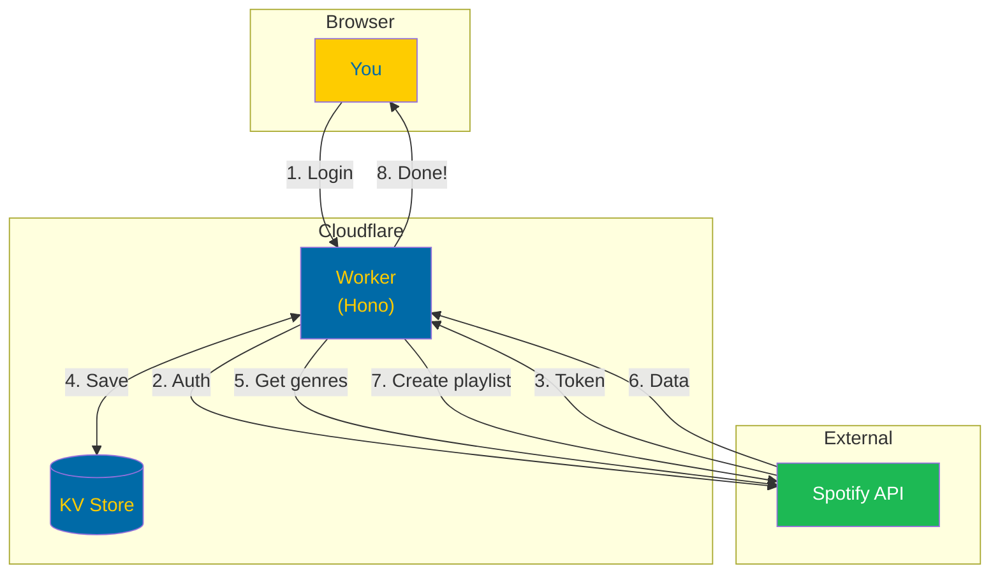
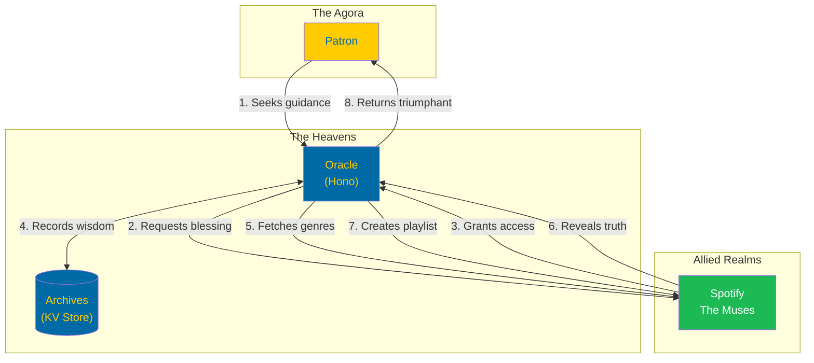
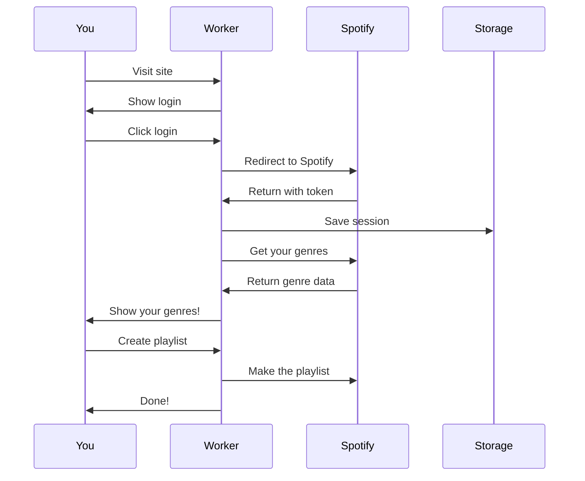
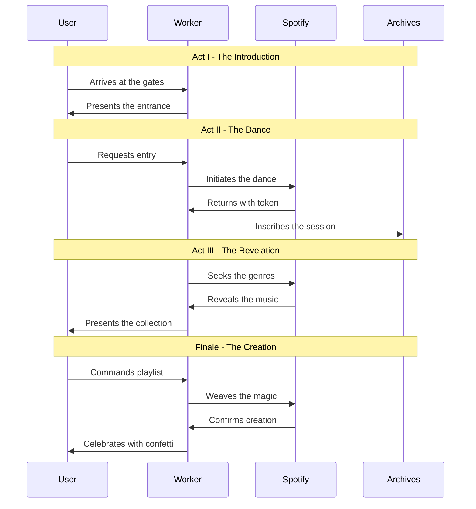
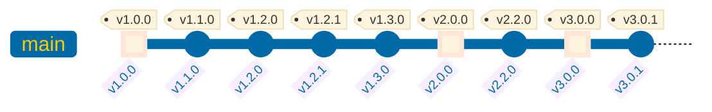

<p align="center">
  
  
  
</p>

<h1 align="center">
  
  <sub>Spotify Genre Sorter</sub>
</h1>

<p align="center">
  <em>Like a swan gliding across a midnight lake, organising your music with effortless grace.</em>
</p>

<p align="center">
  <a href="https://github.com/TomsTech/spotify-genre-sorter/stargazers"></a>
  <a href="https://github.com/TomsTech/spotify-genre-sorter/actions/workflows/ci.yml"></a>
  <a href="https://github.com/TomsTech/spotify-genre-sorter/actions/workflows/deploy.yml"></a>
</p>

<p align="center">
  
  
  
  
  
</p>

---

<p align="center">
  <strong>Transform your Spotify library from chaos to symphony.</strong>
  <em>One click to discover the hidden genres within your favourite songs.</em>
</p>

---

## Table of Contents

<details open>
<summary><strong>Navigate the Archives</strong></summary>

| Section | Description |
|---------|-------------|
| [The Vision](#the-vision) | What this is all about |
| [Quick Start](#quick-start) | Get running in 5 minutes |
| [Complete Guide](#complete-setup-guide) | Full setup walkthrough |
| [Architecture](#architecture) | How it all works |
| [API Reference](#api-endpoints) | Available endpoints |
| [Security](#security) | Protection measures |
| [Development](#local-development) | For contributors |
| [Version History](#version-history) | The journey so far |

</details>

---

## The Vision

> *"In the midst of chaos, there is also opportunity."* — Sun Tzu

Your Spotify library is a treasure trove of musical history — from ancient symphonies to modern anthems, from Nordic folk to Mediterranean rhythms. But finding that perfect playlist? That's where the magic happens.

**Genre Genie** analyses your liked songs, extracts genres from the artists who created them (just as historians extract meaning from primary sources), and lets you create perfectly curated playlists with a single click.

### What Makes It Special

| Feature | Description |
|---------|-------------|
| **Genre Discovery** | Uncover hidden genres you didn't know you loved |
| **Lightning Fast** | Powered by Cloudflare's global edge network |
| **Privacy First** | Your tokens never leave the server |
| **Beautiful UI** | Light and dark themes, Swedish mode Easter egg |
| **Statistics** | Diversity scores, genre breakdowns, export options |
| **Hall of Fame** | Join the pioneers who shaped this project |

---

## Quick Start

> *"Well begun is half done."* — Aristotle

### What You'll Need

- Cloudflare account (free tier works)
- Spotify Developer App
- 5 minutes of your time

---

## Complete Setup Guide

<details>
<summary><strong>Step 1: Fork & Clone</strong> — <em>Lay the Foundation</em></summary>

```bash
git clone https://github.com/TomsTech/spotify-genre-sorter.git
cd spotify-genre-sorter
npm install
```

</details>

<details>
<summary><strong>Step 2: Create Cloudflare API Token</strong> — <em>The Key to the Kingdom</em></summary>

1. Visit [Cloudflare API Tokens](https://dash.cloudflare.com/profile/api-tokens)
2. Click **Create Token**
3. Use **Edit Cloudflare Workers** template
4. Required permissions:

| Scope | Permission |
|-------|------------|
| Account | Workers Scripts > Edit |
| Account | Workers KV Storage > Edit |
| Account | Account Settings > Read |
| Zone | DNS > Edit *(optional, for custom domains)* |

5. Create and **copy your token**

</details>

<details>
<summary><strong>Step 3: Add Token to GitHub</strong> — <em>Seal the Covenant</em></summary>

1. Navigate to **Settings** > **Secrets and variables** > **Actions**
2. Click **New repository secret**
3. Name: `CLOUDFLARE_API_TOKEN`
4. Paste your token

</details>

<details>
<summary><strong>Step 4: Create Spotify Developer App</strong> — <em>The Musical Connection</em></summary>

1. Visit [Spotify Developer Dashboard](https://developer.spotify.com/dashboard)
2. Click **Create App**
3. Configure:

| Field | Value |
|-------|-------|
| App name | `Genre Genie` |
| App description | `Organise liked songs into genre playlists` |
| Redirect URI | `https://spotify-genre-sorter.<subdomain>.workers.dev/auth/spotify/callback` |

4. Select **Web API**
5. Save and copy your **Client ID** and **Client Secret**

</details>

<details>
<summary><strong>Step 5: Set Worker Secrets</strong> — <em>The Sacred Texts</em></summary>

> **This is where most pilgrims lose their way.** Secrets must be set on the Cloudflare Worker, not in GitHub.

```bash
npx wrangler secret put SPOTIFY_CLIENT_ID
npx wrangler secret put SPOTIFY_CLIENT_SECRET
```

The text won't appear as you type — like whispered secrets, they're hidden for protection.

</details>

<details>
<summary><strong>Step 6: Deploy & Verify</strong> — <em>The Moment of Truth</em></summary>

```bash
git push origin main
```

Then verify:

| Endpoint | Expected Response |
|----------|-------------------|
| `/health` | `{"status":"ok"}` |
| `/setup` | `{"configured":true}` |

</details>

---

## Architecture

<details>
<summary><strong>Simple Mode</strong></summary>



</details>

<details open>
<summary><strong>History Nerd Mode</strong> — <em>"Architecture is frozen music."</em></summary>

Like the columns of an ancient temple, each component serves its purpose with elegant simplicity.



</details>

### The OAuth Flow

<details>
<summary><strong>Simple Mode</strong></summary>



</details>

<details open>
<summary><strong>History Nerd Mode</strong> — <em>The Ballet</em></summary>



</details>

---

## API Endpoints

> *"The pen is mightier than the sword."* — Edward Bulwer-Lytton

| Endpoint | Method | Description |
|----------|--------|-------------|
| `/` | GET | The main stage |
| `/health` | GET | Pulse check |
| `/setup` | GET | Configuration status |
| `/session` | GET | Current session |
| `/auth/spotify` | GET | Begin the journey |
| `/auth/logout` | GET | Graceful exit |
| `/api/genres` | GET | Discover your genres |
| `/api/playlist` | POST | Create a single playlist |
| `/api/playlists/bulk` | POST | Create multiple playlists |
| `/api/leaderboard` | GET | The Hall of Fame |
| `/api/scoreboard` | GET | The Rankings |
| `/api/recent-playlists` | GET | Latest creations |

---

## Security

> *"The price of freedom is eternal vigilance."*

Your musical treasures are guarded with the same care as the crown jewels.

### Token Protection

| Shield | Purpose |
|--------|---------|
| **Server-side storage** | Tokens never reach your browser |
| **HttpOnly cookies** | Protected from JavaScript |
| **Secure flag** | HTTPS only transmission |
| **SameSite=Lax** | CSRF prevention |
| **Single-use state** | OAuth states expire after use |

### Fortifications

| Protection | Implementation |
|------------|----------------|
| **Rate limiting** | 30 requests/minute per IP |
| **CORS restriction** | Same-origin only |
| **Input validation** | Track IDs verified |
| **Genre sanitisation** | Dangerous characters stripped |
| **Request limits** | Max 10,000 tracks |

### Security Headers

All responses include:

- `Content-Security-Policy` — strict source controls
- `X-Frame-Options: DENY` — clickjacking prevention
- `X-Content-Type-Options: nosniff` — MIME sniffing blocked
- `Strict-Transport-Security` — HTTPS enforced
- `Referrer-Policy` — information leakage prevented
- `Permissions-Policy` — unnecessary APIs disabled

### Continuous Vigilance

- **CodeQL** — static analysis on every push
- **OWASP ZAP** — API security scanning
- **Snyk** — dependency vulnerability scanning
- **npm audit** — package security checks

---

## Testing

```bash
npm test              # Run all tests
npm run test:watch    # Watch mode
npm run test:coverage # With coverage report
```

**Test Coverage:**
- OAuth URL generation
- Genre extraction logic
- Playlist creation chunking
- Session management
- API response formats

---

## Local Development

Create a `.dev.vars` file:

```ini
SPOTIFY_CLIENT_ID=your_spotify_client_id
SPOTIFY_CLIENT_SECRET=your_spotify_client_secret
```

Then:

```bash
npm run dev
```

> Update your Spotify redirect URI to `http://localhost:8787/auth/spotify/callback` for local testing.

---

## Custom Domain

<details>
<summary><strong>Via GitHub Actions</strong> (Recommended)</summary>

1. Go to **Settings** > **Variables** > **Actions**
2. Add: `CUSTOM_DOMAIN` = `your.domain.com`
3. Re-run the Deploy workflow

</details>

<details>
<summary><strong>Manual Setup</strong></summary>

Via Cloudflare Dashboard: Workers & Pages > your worker > Settings > Triggers > Custom Domains

Remember to update your Spotify redirect URI!

</details>

---

## Troubleshooting

<details>
<summary><strong>"Worker returns error 1042"</strong></summary>

Secrets aren't configured. Verify:
```bash
npx wrangler secret list
```

</details>

<details>
<summary><strong>"redirect_uri_mismatch"</strong></summary>

Your callback URL doesn't match exactly. Check:
- Spotify Dashboard redirect URI
- Must be exactly: `https://your-domain/auth/spotify/callback`

</details>

<details>
<summary><strong>"/setup shows missing secrets"</strong></summary>

Secrets are per-worker. Specify the worker name:
```bash
npx wrangler secret put SPOTIFY_CLIENT_ID --name spotify-genre-sorter
```

</details>

---

## Version History

> *"Those who cannot remember the past are condemned to repeat it."* — George Santayana



| Era | Version | Chronicle |
|-----|---------|-----------|
| | v3.0.1 | Release workflow fix, README cleanup |
| | **v3.0.0** | Progressive scanning for vast libraries, admin sanctum, celebratory confetti, the Goldblum enigma |
| | v2.2.0 | Sorted rankings, track counting |
| | **v2.0.0** | The Genre Genie transformation, leaderboards, scoreboards, the great sidebar |
| | v1.3.0 | Documentation codex, SEO enchantments |
| | v1.2.1 | The great track limit remedy |
| | v1.2.0 | Theme duality, hidden realms, statistics |
| | v1.1.0 | Security fortifications, resilient connections |
| | **v1.0.0** | The genesis — Hall of Fame, Swedish mysteries |

See [CHANGELOG.md](CHANGELOG.md) for the complete chronicles.

---

## Notes

- Genres are derived from **artists**, not individual tracks
- Large libraries require patience (paginated API calls)
- Playlists are created as **private** by default
- Sessions expire after 7 days

---

## License

Free for personal use. Commercial endeavours require a license — see [LICENSE](LICENSE).

---


<p align="center">
  
  
  
</p>

<p align="center">
  <sub>
    <em>
      "Music gives a soul to the universe, wings to the mind,
      flight to the imagination, and life to everything."
    </em>
    — Plato
  </sub>
</p>

<p align="center">
  <sub>
    For someone who appreciates Swan Lake,
    ancient histories, and Taylor Swift in equal measure.
  </sub>
</p>

<p align="center">
  <strong>For Heidi</strong> 🦢
</p>

---

<sub>
  <em>
    Like Lady Jane Grey with her books, or the scribes of ancient Rome —
    we write our stories in code, hoping they echo through time.
  </em>
</sub>
