# Spotify Genre Sorter

[](https://github.com/YOUR_USERNAME/spotify-genre-sorter/actions/workflows/ci.yml)
[](https://github.com/YOUR_USERNAME/spotify-genre-sorter/actions/workflows/deploy.yml)
[](LICENSE)
[](https://www.typescriptlang.org/)
[](https://workers.cloudflare.com/)

Organise your Spotify liked songs into genre-based playlists with one click.

> 🇸🇪 *For Heidi x, hopefully you know why I disappear for so long, I'm just dicking my keyboard for countless hours instead* 🤓

## Features

- GitHub SSO authentication (whitelist specific users)
- Spotify OAuth integration
- View all genres in your liked songs
- Create playlists for individual genres or bulk create
- Modern, minimal dark UI
- 🥚 Varför läser du detta? Gå och lek någon annanstans, din nyfikna smansen!

## Architecture

### System Overview


### Authentication Flow


### CI/CD Pipeline

```mermaid
flowchart LR
    subgraph CI["🔍 CI"]
        L[Lint] --> T[TypeCheck]
        T --> S[Security]
        S --> B[Build]
    end

    subgraph CD["🚀 CD"]
        B --> D[Deploy]
        D --> V[Verify]
        V --> DNS[DNS Check]
    end

    subgraph R["📦 Release"]
        DNS --> CL[Changelog]
        CL --> GHR[GitHub Release]
    end
```



## Quick Start

### Option 1: Interactive Setup

```bash
npm install
npm run setup
```

The setup script will:
- Authenticate with Cloudflare
- Create KV namespace
- List your DNS zones for custom domain selection
- Collect OAuth credentials
- Configure everything automatically

### Option 2: Manual Setup

1. **Create OAuth Apps**
   - [GitHub OAuth App](https://github.com/settings/developers)
   - [Spotify Developer App](https://developer.spotify.com/dashboard)

2. **Create KV Namespace**
   ```bash
   npx wrangler kv:namespace create SESSIONS
   ```
   Update `wrangler.toml` with the ID

3. **Set Secrets**
   ```bash
   npx wrangler secret put GITHUB_CLIENT_ID
   npx wrangler secret put GITHUB_CLIENT_SECRET
   npx wrangler secret put SPOTIFY_CLIENT_ID
   npx wrangler secret put SPOTIFY_CLIENT_SECRET
   ```

4. **Deploy**
   ```bash
   npm run deploy
   ```

## Custom Domain Setup

### Via Pipeline (Recommended)

Set repository variables in GitHub:
- `CUSTOM_DOMAIN`: Your custom domain (e.g., `spotify.example.com`)
- `WORKER_SUBDOMAIN`: Or just a subdomain for workers.dev

Then trigger a deploy via "Run workflow" with your domain.

### Via Setup Script

Run `npm run setup` and select your DNS zone when prompted.

## GitHub Actions Setup

### Required Secret

| Secret | Required | Description |
|--------|----------|-------------|
| `CLOUDFLARE_API_TOKEN` | **Yes** | API token with Workers permissions |
| `SNYK_TOKEN` | No | Optional security scanning ([get token](https://app.snyk.io/account)) |

### Optional Variable

| Variable | Description |
|----------|-------------|
| `CUSTOM_DOMAIN` | Your custom domain (e.g., `spotify.example.com`) |

### How to Get Your Cloudflare API Token

1. Go to [Cloudflare Dashboard](https://dash.cloudflare.com/profile/api-tokens)
2. Click **Create Token**
3. Use the **Edit Cloudflare Workers** template, OR create custom with:
   - `Account > Workers Scripts > Edit`
   - `Account > Workers KV Storage > Edit`
   - `Zone > DNS > Edit` (if using custom domain)
   - `Account > Account Settings > Read` (for auto-detection)
4. Copy the token and add as `CLOUDFLARE_API_TOKEN` secret in GitHub

> **Note**: Account ID is auto-detected from your API token - no need to configure separately!

### DNS Conflict Detection

The pipeline automatically checks for existing DNS records before deployment:
- If a record exists for your custom domain, deployment **stops** with a clear error
- To override, re-run the workflow with **"Force DNS update"** checked
- This prevents accidentally breaking existing services

## Pipeline Features

| Stage | Checks |
|-------|--------|
| **Lint** | ESLint code quality |
| **Type** | TypeScript static analysis |
| **Security** | npm audit, Snyk, CodeQL |
| **Deploy** | Cloudflare Workers |
| **Verify** | Health check, DNS, SSL |
| **Release** | Auto-changelog on tags |

## Local Development

```bash
# Create .dev.vars with your OAuth credentials
npm run dev
```

OAuth callback URLs for local: `http://localhost:8787/auth/*/callback`

## API Endpoints

| Endpoint | Method | Description |
|----------|--------|-------------|
| `/session` | GET | Session status |
| `/auth/github` | GET | GitHub OAuth |
| `/auth/spotify` | GET | Spotify OAuth |
| `/auth/logout` | GET | Clear session |
| `/api/genres` | GET | Get all genres |
| `/api/playlist` | POST | Create one playlist |
| `/api/playlists/bulk` | POST | Create multiple |

## Releases

Uses [Conventional Commits](https://www.conventionalcommits.org/):

```bash
git tag v1.0.0
git push origin v1.0.0
```

Auto-generates changelog and GitHub release.

## File Structure

```text
├── .github/workflows/   # CI/CD pipelines
├── scripts/setup.mjs    # Interactive setup
├── src/
│   ├── index.ts         # Main + UI
│   ├── routes/          # Auth & API
│   └── lib/             # Helpers
├── wrangler.toml        # Cloudflare config
└── cliff.toml           # Changelog config
```

## Notes

- Genres are assigned to **artists**, not tracks
- Large libraries may take a moment (API pagination)
- Playlists are created as private

## License

Free for personal use. Commercial use requires a paid license — see [LICENSE](LICENSE).

---

<sub> *För min raring, Heidi*</sub>
