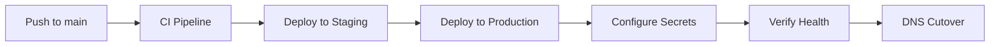
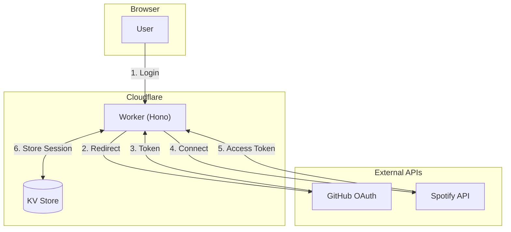
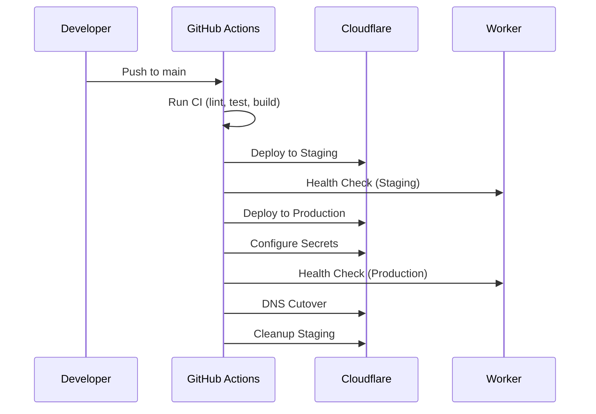

# Spotify Genre Sorter v1.1.0 - Härlig

> **Release Date:** 2025-12-01
> **Codename:** Härlig (Swedish for "Lovely/Delightful")

---

## Overview

This release brings significant improvements to CI/CD reliability, security automation, documentation, and developer experience. The deployment pipeline now automatically configures secrets, making deployments fully hands-off.

---

## What's New

### Automated Secrets Configuration

The deploy pipeline now automatically configures Cloudflare Worker secrets:



- **SPOTIFY_CLIENT_ID** - Auto-configured from GitHub secrets
- **SPOTIFY_CLIENT_SECRET** - Auto-configured from GitHub secrets
- **SPOTIFY_ONLY_AUTH** - Auto-enabled for Spotify-only authentication

### Enhanced Architecture Documentation

Added comprehensive Mermaid diagrams to README:



### Improved CI/CD Pipeline

| Improvement | Description |
|-------------|-------------|
| **npm install** | Replaced `npm ci` for cross-platform compatibility |
| **Cloudflare API** | KV namespace setup now uses direct API calls |
| **Auto-secrets** | Secrets configured automatically after deploy |
| **Force DNS** | Option to force DNS updates on conflicts |

---

## Security Improvements

### API Hardening

| Protection | Implementation |
|------------|----------------|
| Rate limiting | 30 requests/minute per IP |
| CORS restriction | Same-origin only |
| Input validation | Track IDs validated (22-char alphanumeric) |
| Genre sanitisation | Dangerous characters stripped |
| Request limits | Max 10,000 tracks, 50 genres per bulk |

### Security Headers

All responses include:

- `Content-Security-Policy` - Strict source restrictions
- `X-Frame-Options: DENY` - Clickjacking prevention
- `X-Content-Type-Options: nosniff` - MIME sniffing prevention
- `Strict-Transport-Security` - HTTPS enforcement
- `Referrer-Policy` - Referrer leakage prevention

---

## Bug Fixes

- Fixed ESLint `no-useless-escape` error in regex pattern
- Fixed ESLint `no-unnecessary-type-assertion` errors
- Fixed `npm ci` failures due to lock file sync issues
- Fixed KV namespace detection with wrangler 4.x syntax
- Fixed secrets.yml workflow npm install

---

## Developer Experience

### Git History Cleanup

All commits now show **TomsTech** as the author for cleaner contributor attribution.

### Documentation Updates

- Added Mermaid flowchart for system architecture
- Added Mermaid sequence diagram for authentication flow
- Updated Security section with comprehensive tables
- Added flat-square GitHub stars badge (visible on dark backgrounds)

---

## Deployment Architecture



---

## Upgrade Guide

### From v1.0.0

No breaking changes. Simply pull the latest code and push to trigger a new deployment:

```bash
git pull origin main
git push origin main
```

The pipeline will automatically:
1. Run CI checks
2. Deploy to staging
3. Deploy to production
4. Configure secrets
5. Verify health
6. Update DNS

### New Installations

1. Fork the repository
2. Add `CLOUDFLARE_API_TOKEN` to GitHub secrets
3. Add `SPOTIFY_CLIENT_ID` and `SPOTIFY_CLIENT_SECRET` to GitHub secrets
4. Push to main branch

---

## Technical Details

### Dependencies

| Package | Version |
|---------|---------|
| Wrangler | 4.51.0 |
| TypeScript | 5.6 |
| Hono | Latest |
| Vitest | Latest |

### Supported Platforms

- Cloudflare Workers (production)
- Node.js 20+ (local development)

---

## Known Issues

- Custom domain `spotify.houstons.tech` may take time for DNS propagation
- Workers.dev URL works immediately after deploy

---

## Contributors

- **TomsTech** - Lead Developer

---

## Links

- **Live Site:** https://spotify-genre-sorter.dev-playground-df5.workers.dev
- **Repository:** https://github.com/TomsTech/spotify-genre-sorter
- **Documentation:** See README.md

---

*För Heidi* 💙💛
