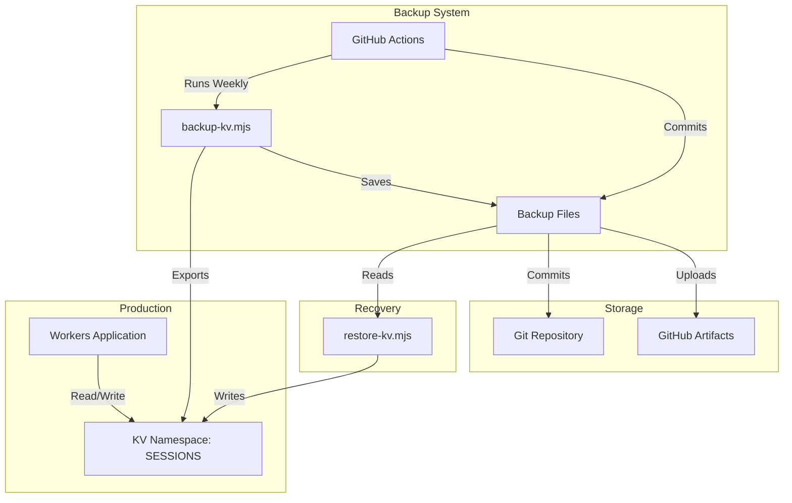
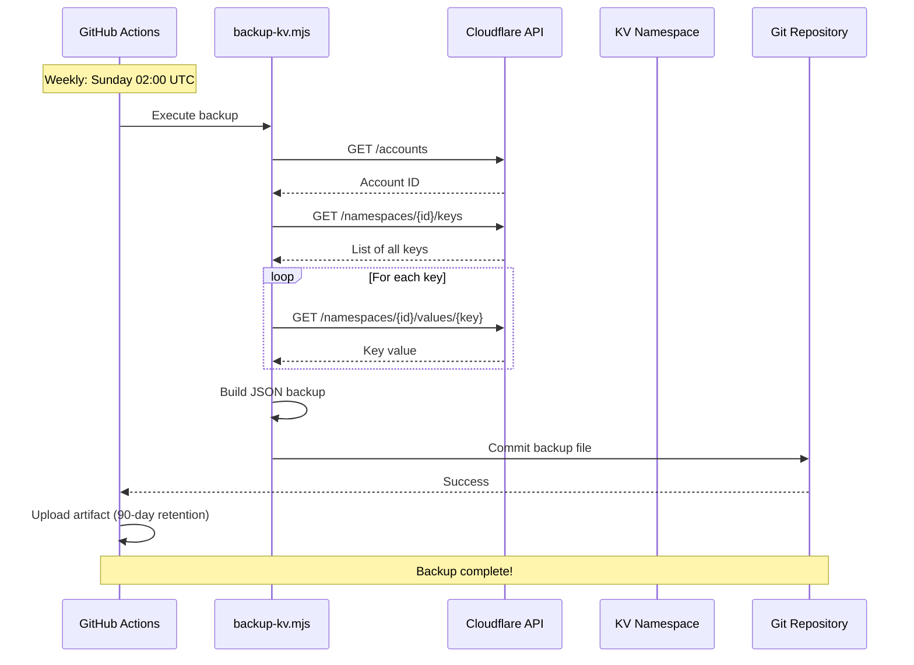
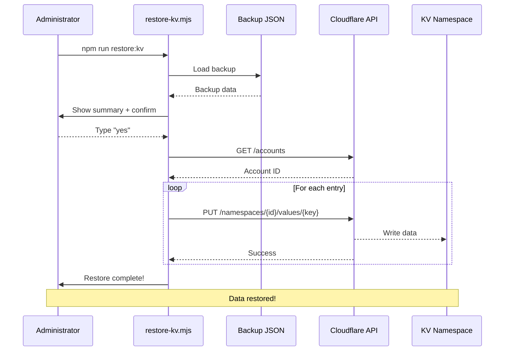

# Backup & Disaster Recovery

> Comprehensive backup and recovery procedures for Genre Genie Cloudflare Workers application.

---

## Table of Contents

1. [Data Inventory](#data-inventory)
   - [Cloudflare KV Storage](#cloudflare-kv-storage)
   - [Criticality Assessment](#criticality-assessment)
2. [Backup Strategy](#backup-strategy)
   - [Automated Backups](#automated-backups)
   - [Off-Site Backup Consideration](#off-site-backup-consideration)
   - [Manual Backups](#manual-backups)
3. [Restore Procedures](#restore-procedures)
   - [Full Restore](#full-restore)
   - [Partial Restore](#partial-restore)
4. [Recovery Objectives](#recovery-objectives)
   - [Recovery Time Objective (RTO)](#recovery-time-objective-rto)
   - [Recovery Point Objective (RPO)](#recovery-point-objective-rpo)
5. [Testing & Validation](#testing--validation)
   - [Quarterly DR Test Schedule](#quarterly-dr-test-schedule)
   - [Test Scenarios](#test-scenarios)
   - [DR Test Documentation](#dr-test-documentation)
6. [Incident Response](#incident-response)
7. [Architecture Diagrams](#data-architecture-diagram)

---

## Data Inventory

### Cloudflare KV Storage

All application data is stored in a single Cloudflare KV namespace: **SESSIONS**

| Data Type | Key Pattern | Criticality | Retention | Example |
|-----------|-------------|-------------|-----------|---------|
| User sessions | `session:{uuid}` | Recoverable | 7 days | Login tokens, OAuth state |
| User registration | `user:{spotifyId}` | **Critical** | Permanent | User profile, registration date |
| User statistics | `user_stats:{spotifyId}` | **Critical** | Permanent | Playlists created, genres discovered |
| User count | `stats:user_count` | Important | Permanent | Total registered users |
| Hall of Fame | `hof:{position}` | **Critical** | Permanent | First 100 users (pioneers) |
| Scoreboard cache | `scoreboard_cache` | Transient | 5 min | Rankings (regenerable) |
| Recent playlists | `recent_playlists` | Important | Permanent | Social feed data |
| Analytics (daily) | `analytics:daily:{date}` | Important | 7 days | Usage metrics |
| Analytics events | `analytics:event:{type}` | Transient | 24 hours | Real-time event tracking |
| Scan progress | `scan_progress:{userId}` | Transient | 1 hour | Library scan checkpoints |

**Total Keys**: ~500-1000 (depending on user count)
**Data Size**: ~1-5 MB
**Critical Data**: User registrations, statistics, Hall of Fame

### Criticality Assessment

Data is classified into four tiers based on recovery priority and user impact:

| Tier | Classification | Data Types | Recovery Priority |
|------|---------------|------------|-------------------|
| **1 - Critical** | Irreplaceable user data | User registrations, Hall of Fame, user statistics | Must restore immediately |
| **2 - Important** | Valuable but reconstructable | User count, leaderboard, recent playlists, analytics | Restore within RTO |
| **3 - Recoverable** | User can regenerate | Session data (users re-login) | Restore if convenient |
| **4 - Transient** | Automatically regenerates | Scoreboard cache, scan progress, event logs | No restoration needed |

**Impact Analysis:**

- **Critical data loss**: Users lose registration status, pioneer badges, all-time statistics
- **Important data loss**: Leaderboards reset, recent playlists feed empty (rebuilds over time)
- **Recoverable data loss**: Users must re-authenticate (minor inconvenience)
- **Transient data loss**: No user impact (auto-regenerates within minutes)

---

## Backup Strategy

### Automated Backups

**Schedule**: Weekly on Sundays at 02:00 UTC

**GitHub Actions Workflow**: `.github/workflows/backup.yml`

**Process**:
1. Runs `scripts/backup-kv.mjs` to export all KV data
2. Generates timestamped JSON file (`kv-backup-YYYY-MM-DD.json`)
3. Uploads as GitHub Actions artifact (90-day retention)
4. Commits backup file to Git repository (permanent retention)

**Storage Locations**:
- **GitHub Repository** (`/backups/` directory) - Primary long-term storage
- **GitHub Actions Artifacts** - 90-day retention for quick access

### Off-Site Backup Consideration

For enhanced disaster recovery, consider adding Cloudflare R2 as a secondary backup destination:

**Proposed R2 Backup Architecture:**
```
Weekly Backup → GitHub (primary) + R2 (secondary)
                ↓                    ↓
          Git repository       Object storage
          (version control)    (geographic redundancy)
```

**R2 Benefits:**
- Geographic redundancy (independent of GitHub)
- Larger storage capacity for historical backups
- Native Cloudflare integration
- Lower egress costs than S3

**Implementation** (future enhancement):
```bash
# Add to backup.yml workflow
- name: Upload to R2
  run: |
    npx wrangler r2 object put genre-genie-backups/kv-backup-$DATE.json \
      --file=backups/kv-backup-$DATE.json
```

> **Current Status**: R2 backup not implemented. GitHub provides adequate redundancy for current scale.

### Manual Backups

Run manual backup anytime:

```bash
# Set environment variables
export CLOUDFLARE_API_TOKEN="your-api-token"

# Run backup script
npm run backup:kv

# Backup saved to: ./backups/kv-backup-YYYY-MM-DD.json
```

### Backup File Structure

```json
{
  "version": "1.0",
  "timestamp": "2025-12-05T10:30:00.000Z",
  "accountId": "abc123...",
  "namespaces": [
    {
      "namespace": "SESSIONS",
      "namespaceId": "d6874dfad2c344c9a9b8518601ae46ac",
      "timestamp": "2025-12-05T10:30:00.000Z",
      "keyCount": 756,
      "entries": [
        {
          "key": "user:spotify123",
          "value": "{\"spotifyId\":\"spotify123\",\"spotifyName\":\"John Doe\",...}",
          "metadata": null
        }
      ]
    }
  ]
}
```

---

## Restore Procedures

### Full Restore

**When to use**: Complete data loss, corrupted KV namespace, migration to new account

**Steps**:

1. **Locate backup file**:
   ```bash
   # Use latest backup
   ls -lah backups/

   # Or download from GitHub Actions artifacts
   # Go to: https://github.com/TomsTech/spotify-genre-sorter/actions
   ```

2. **Set environment variables**:
   ```bash
   export CLOUDFLARE_API_TOKEN="your-api-token-with-kv-write-access"
   export CLOUDFLARE_ACCOUNT_ID="your-account-id"  # Optional, auto-detected
   ```

3. **Run restore script**:
   ```bash
   # Restore from latest backup
   npm run restore:kv

   # Or restore from specific backup
   node scripts/restore-kv.mjs backups/kv-backup-2025-12-01.json
   ```

4. **Confirm restore**:
   - Script will show summary of data to be restored
   - Type `yes` to confirm (THIS WILL OVERWRITE EXISTING DATA!)

5. **Verify restoration**:
   ```bash
   # Check user count
   curl https://spotify.houstons.tech/stats

   # Check specific user
   # (requires logged-in session)
   ```

### Partial Restore

**When to use**: Recover specific user data, restore deleted entries

**Steps**:

1. **Extract data from backup**:
   ```bash
   # Load backup file
   cat backups/kv-backup-latest.json | jq '.namespaces[0].entries[] | select(.key | startswith("user:spotify123"))'
   ```

2. **Manually restore via Wrangler**:
   ```bash
   # Restore specific key
   echo '{"spotifyId":"..."}' | wrangler kv:key put "user:spotify123" --binding=SESSIONS
   ```

3. **Verify**:
   ```bash
   wrangler kv:key get "user:spotify123" --binding=SESSIONS
   ```

---

## Recovery Objectives

### Recovery Time Objective (RTO)

**Target**: 30 minutes from incident detection to full service restoration

| Scenario | RTO | Actions |
|----------|-----|---------|
| Worker outage | 5 min | Redeploy from Git (`npm run deploy`) |
| KV corruption | 30 min | Restore from latest backup |
| Complete data loss | 1 hour | Full restore + verification |
| Account access loss | 4 hours | Contact Cloudflare support + restore to new account |

### Recovery Point Objective (RPO)

**Target**: Maximum 7 days of data loss

- **User sessions**: Acceptable loss (users re-login)
- **User registrations**: Max 7 days loss (users re-register)
- **Analytics data**: Max 7 days loss (acceptable)
- **Recent playlists**: Max 7 days loss (regenerable from Spotify API)

**Improvement Opportunity**: Consider daily backups for critical production use.

---

## Testing & Validation

### Quarterly DR Test Schedule

DR drills are scheduled for the first Sunday of each quarter:

| Quarter | Test Date | Status | Next Test |
|---------|-----------|--------|-----------|
| Q1 2025 | 2025-01-05 | Pending | - |
| Q2 2025 | 2025-04-06 | Pending | - |
| Q3 2025 | 2025-07-06 | Pending | - |
| Q4 2025 | 2025-10-05 | Pending | - |

**Test Coordinator**: Repository owner
**Test Duration**: ~1 hour
**Notification**: Create GitHub issue 1 week before scheduled test

### Backup Verification

**Frequency**: After every backup (automated in GitHub Actions)

**Checks**:
- [ ] Backup file created successfully
- [ ] File size > 1KB (not empty)
- [ ] Valid JSON structure
- [ ] Contains expected namespace
- [ ] Key count matches expected range
- [ ] Committed to Git repository

### Restore Testing

**Frequency**: Quarterly (every 3 months)

**Test Procedure**:

1. **Setup test environment**:
   ```bash
   # Create test KV namespace
   wrangler kv:namespace create "SESSIONS_TEST"
   ```

2. **Modify restore script** to use test namespace ID

3. **Run restore**:
   ```bash
   node scripts/restore-kv.mjs backups/kv-backup-latest.json
   ```

4. **Verify data**:
   ```bash
   wrangler kv:key list --binding=SESSIONS_TEST
   wrangler kv:key get "user:test123" --binding=SESSIONS_TEST
   ```

5. **Validate counts**:
   - Compare key count with backup file
   - Spot-check 10 random entries
   - Verify JSON integrity

6. **Clean up**:
   ```bash
   wrangler kv:namespace delete --namespace-id="test-namespace-id"
   ```

**Success Criteria**:
- 100% of keys restored
- No data corruption
- Restore completes in < 10 minutes

### Test Scenarios

Each quarterly DR drill should include at least one of these scenarios:

| Scenario | Description | Success Criteria |
|----------|-------------|------------------|
| **Full Restore** | Complete namespace restoration from backup | All keys restored, app functional |
| **Partial Restore** | Restore specific user data | Target keys restored, no collateral changes |
| **Point-in-Time** | Restore from older backup | Correct timestamp data restored |
| **Cross-Account** | Restore to different CF account | Data accessible in new account |
| **Backup Validation** | Verify backup integrity without restore | JSON valid, key count matches |

### DR Test Documentation

After each quarterly test, document results:

```markdown
## DR Test Results - YYYY-MM-DD

**Scenario Tested**: [Full Restore / Partial / etc.]
**Backup Used**: kv-backup-YYYY-MM-DD.json
**Test Namespace**: SESSIONS_TEST

### Results
- [ ] Backup file accessible
- [ ] JSON structure valid
- [ ] Restore script executed successfully
- [ ] All keys restored (X of Y)
- [ ] Data integrity verified
- [ ] RTO met (actual: X minutes)

### Issues Found
- None / List any issues

### Action Items
- None / List improvements needed

**Tester**: [Name]
**Next Test**: YYYY-MM-DD
```

Save test results in: `docs/dr-tests/YYYY-MM-DD-test-results.md`

---

## Incident Response

### Incident Types

#### 1. Data Corruption

**Symptoms**: Invalid JSON in KV values, missing required fields

**Response**:
1. Identify corrupted keys
2. Restore specific keys from backup
3. Validate restored data
4. Monitor for recurrence

#### 2. Accidental Deletion

**Symptoms**: Users report missing data, key count decreased

**Response**:
1. Identify deleted key pattern
2. Extract from latest backup
3. Restore deleted keys
4. Implement safeguards (backups before bulk operations)

#### 3. Complete KV Namespace Loss

**Symptoms**: All keys missing, empty namespace

**Response**:
1. **Immediate**: Deploy holding page explaining maintenance
2. **Restore**: Run full restore from latest backup (30 min)
3. **Verify**: Check user count, sample user data
4. **Notify**: Update status page when complete
5. **Post-mortem**: Investigate root cause

#### 4. Worker Deployment Failure

**Symptoms**: 502/503 errors, deployment failed in GitHub Actions

**Response**:
1. **Rollback**: Revert to previous Git commit
2. **Redeploy**: `git push` triggers automatic deployment
3. **Verify**: Check `/health` endpoint
4. **Fix**: Address deployment issue in new commit

### Contact & Escalation

| Issue | Contact | Response Time |
|-------|---------|---------------|
| KV access issues | Cloudflare Support | 4 hours |
| GitHub Actions failures | GitHub Support | 24 hours |
| Data corruption | Internal review | Immediate |
| Security incident | Immediate halt + review | Immediate |

---

## Data Architecture Diagram



---

## Backup Sequence Diagram



---

## Recovery Sequence Diagram



---

## Checklist: Disaster Recovery Drill

Run this drill **quarterly** to ensure readiness:

- [ ] **Preparation**
  - [ ] Create test KV namespace
  - [ ] Set environment variables
  - [ ] Download latest backup

- [ ] **Backup Verification**
  - [ ] Backup file exists in Git repo
  - [ ] Backup artifact available in GitHub Actions
  - [ ] File size is reasonable (> 1KB)
  - [ ] JSON structure is valid

- [ ] **Restore Test**
  - [ ] Run restore script on test namespace
  - [ ] Verify key count matches backup
  - [ ] Spot-check 10 random entries
  - [ ] Validate all data types (users, stats, hof, etc.)

- [ ] **Performance Test**
  - [ ] Time the restore process
  - [ ] Ensure RTO met (< 30 min)
  - [ ] Monitor API rate limits

- [ ] **Documentation Review**
  - [ ] Update this document if needed
  - [ ] Review contact information
  - [ ] Update incident response procedures

- [ ] **Clean Up**
  - [ ] Delete test namespace
  - [ ] Document test results
  - [ ] Schedule next drill

---

## Backup Retention Policy

| Backup Type | Retention | Location | Purpose |
|-------------|-----------|----------|---------|
| Weekly automated | Permanent | Git repository | Long-term recovery |
| Weekly automated | 90 days | GitHub Artifacts | Quick access |
| On-demand manual | Permanent | Local/manual storage | Pre-change safety |
| Pre-deployment | 30 days | Local CI cache | Rollback capability |

---

## Related Documentation

- [Monitoring Guide](./monitoring.md) - BetterStack monitoring setup
- [High Availability Guide](./high-availability.md) - HA architecture and retry logic
- [API Reference](./api.md) - API endpoints and data structures
- [Security Architecture](./security.md) - Security headers and best practices

---

## Revision History

| Date | Version | Changes |
|------|---------|---------|
| 2025-12-05 | 1.0 | Initial backup & DR documentation |
| 2025-12-27 | 1.1 | Added criticality assessment tiers, off-site backup considerations, quarterly DR test schedule, test scenarios and documentation template |

---

*Last updated: 2025-12-27*
*Owner: TomsTech*
*Review frequency: Quarterly*
